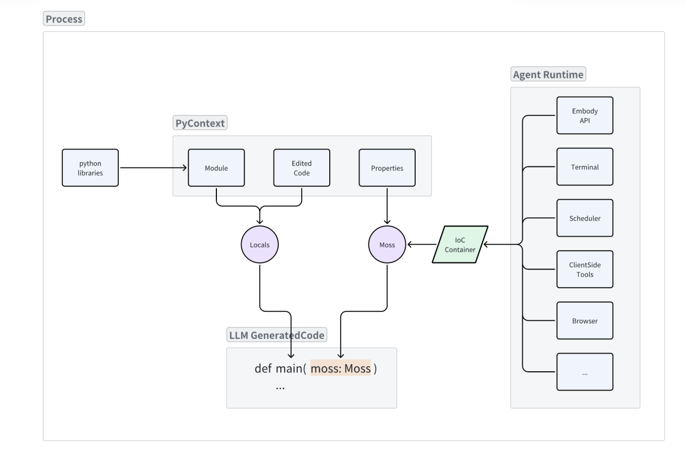
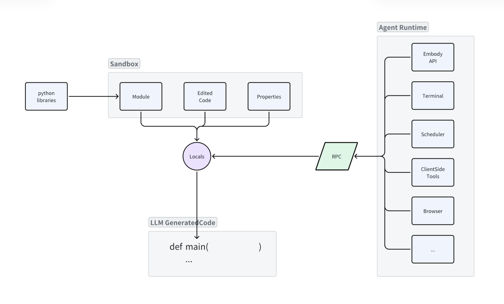

# Background


## 关键概念
- MOSS: 当前的框架，准备随论文一起开源
  LLM-oriented: 对标的是 "Human-oriented", 指这个东西是给LLM用的, 而不是给人用的
  Operating System, 对标的是未来的目标, 即通过高级语言提供LLM去操作OS的一些基本能力.  目前提供的是 工具,  shell drivers,  multi-task, taskflow  这些. 
  simulation: 它是python形式的界面, 给LLM交互用, 而不是真正可以 from import 的
- GhostOS: 比MOSS更大的框架，MOSS是它的一个子框架，但是这次不打算开源
- 框架代码: agent所在框架，也就是MOSS或GhostOS本身的代码
- agent动态生成的代码，即每轮对话中，agent生成的代码
- 动态实例: LLM运行过程中的prompt对应code，把接口换成对应实例
- 环境代码: 目标workspace / environment的代码
- 静态代码: 项目里的文件代码
- 

## LKP原则的运用

面向接口编程, LLM prompt最小原则, 任务设置时不知道环境中有状态的对象实例(这个才重要)，需要运行时才知道
IoC容器必要性: 1. 面向接口编程 + 2. 所见即所得   
如果没有 IoC 容器, Agent runtime 中所有的能力都只能通过协议通讯来实现, 对它们的调用也失去了图灵完备的能力
要达到全代码的效果, 就必须封装 RPC 协议
IoC 的价值就是取代掉 RPC 协议, 同时也兼容 RPC 协议, 并且解决类库之间的拓扑依赖问题.


PyContext and Agent runtime interaction in same process:



PyContext and Agent runtime interaction with RPC protocol:


IoC + decorator实现LKP

SOLID Principle:
- Single Responsibility Principle (SRP): 一个类应该只有一个引起变化的原因。
- Open/Closed Principle (OCP): 软件实体（类、模块、函数等）应该对扩展开放，对修改关闭。
- Liskov Substitution Principle (LSP): 子类型必须能够替换掉它们的基类型。
- Interface Segregation Principle (ISP): 客户端不应该依赖它不需要的接口。
- Dependency Inversion Principle (DIP): 高层模块不应该依赖低层模块，两者都应该依赖抽象。
对应这个框架:
S: 通过 moss 文件提供最小化的 agent 能力, 通过 library 封装独立的工具能力
O: 使用 tool 的 agent 在使用 library 时, 只了解其抽象和调用方式, 而负责 edit 的 agent 才能优化和改进library的实现. 
L: 所有基于 IoC 容器引用的抽象, 都是可替换的, 不影响 LLM 基于抽象生成的决策动作. 
I: 注入到 Moss 上的只是抽象, LLM 通过 interface 理解 library 的使用方式而不关心实现. 
D: Moss 的默认反射机制追求屏蔽源代码和冗余信息, 只提供引用的类库, 方法的基本使用方式, 包括 signature, 参数, doc 等.

## GhostOS中关键源码:
- DefaultAIFuncManagerImpl维护AIFunc运行过程中的调用栈和最大深度,以及每个大栈帧中的最大步数, 每个大栈帧中新建一个driver, 每个大栈帧创建时有自己的IoC容器(parent为之前的IoC容器)
- DefaultAIFuncManagerImpl包含container, driver, 它负责execute, execute时调用driver去initialize, think, on_save
  DefaultAIFuncManagerImpl的execute(AIFunc)方法: 相当于每个大栈帧的执行
  ```python
    def execute(self, fn: AIFunc) -> AIFuncResult:
        self._aifunc_name = generate_import_path(type(fn))
        driver = self.get_driver(fn)
        thread = driver.initialize()
        step = 0
        finished = False
        result = None
        while not finished:
            step += 1
            if self._max_step != 0 and step > self._max_step:
                raise RuntimeError(f"exceeded max step {self._max_step}")
            # driver.think() 是核心, 它负责调用 MossCompiler 编译LLM生成的代码, 然后 exec 执行
            # 如果LLM生成的代码里包含了执行AIFunc，就会入栈一个新栈帧，执行新的execute(), depth += 1
            # 如果LLM生成的代码里没有AIFunc，只是普通python 代码，那么只会在当前这个大栈帧里执行这个while循环, depth不变, step += 1
            thread, result, finished = driver.think(self, thread)
            driver.on_save(manager=self, thread=thread)
            if finished:
                break
        if result is not None and not isinstance(result, AIFuncResult):
            result_type = get_aifunc_result_type(type(fn))
            raise RuntimeError(f"result is invalid AIFuncResult {type(result)}, expecting {result_type}")
        return result
  ```
- container是IoC容器, 包含了AIFuncCtx, MossCompiler
- driver中包含initialize(), think(), on_save(). 其中initialize()中会返回MsgThread对象. driver.think():
  ```python
    def think(self, manager: AIFuncManager, thread: MsgThread):
        compiler = manager.compiler()
        compiler.join_context(thread.get_pycontext())
        compiler.bind(self.aifunc.__class__, self.aifunc)
        runtime = compiler.compile(None)
        # 使用默认的方法, 将 thread 转成 chat.
        systems = self.generate_system_messages(runtime)
        systems.append(Role.SYSTEM.new(
            content=DEFAULT_NOTICES,
        ))
        self.on_system_messages(systems)
        chat = thread_to_chat(thread.id, systems, thread)
        self.on_chat(chat)  # Whether you want to send chat to llm, let it generate code for you or not
        # 实例化 llm api
        llms = manager.container().force_fetch(LLMs)
        llm_api = get_aifunc_llmapi(self.aifunc, llms)
        if llm_api is None:
            llm_api = manager.default_llm_api()
        # 调用 llm api
        ai_generation = llm_api.chat_completion(chat)
        # 插入 ai 生成的消息.
        thread.append(ai_generation)
        self.on_message(ai_generation)  # Whether you want to execute the ai-generated code or not
        code = self.parse_moss_code_in_message(ai_generation)
  
        # code 相关校验:
        if not code:
            thread.append(Role.SYSTEM.new(content="Error! You shall only write python code! DO NOT ACT LIKE IN A CHAT"))
            logger.error(f"ai_generation: {repr(ai_generation)}")
            return thread, None, False
        if "main(" not in code:
            thread.append(Role.SYSTEM.new(content="Error! No main function found in your generation!"))
            return thread, None, False
  
        result = None
        # 运行 moss.
        try:
            executed = runtime.execute(code=code, target='main', local_args=['moss'], kwargs={"fn": self.aifunc})
            result, finish = executed.returns
            if not isinstance(finish, bool):
                raise RuntimeError(f"Result from main function {finish} is not boolean")
  
            outputs = executed.std_output
            if outputs:
                output_message = Role.SYSTEM.new(
                    content=f"## Observation\n\nmoss executed main, std output is: \n{outputs}"
                )
                messages = [output_message]
            else:
                output_message = Role.SYSTEM.new(
                    content=f"## Observation\n\nhave not printed anything"
                )
                messages = [output_message]
            pycontext = executed.pycontext
            thread.new_turn(
                event=DefaultEventType.OBSERVE.new(
                    messages=messages,
                    task_id=thread.id,
                    from_task_id=thread.id,
                ),
                pycontext=pycontext,
            )
            self.error_times = 0
        except Exception as e:
            exe_info = "\n".join(traceback.format_exception(e)[-5:])
            output_message = Role.SYSTEM.new(
                content=f"moss executed main, exception occurs: \n{exe_info}"
            )
            thread.new_turn(
                event=DefaultEventType.OBSERVE.new(
                    messages=[output_message],
                    task_id=thread.id,
                    from_task_id=thread.id,
                ),
            )
            self.error_times += 1
            if self.error_times >= 3:
                raise RuntimeError(f"AIFunc `{self.name()}` failed {self.error_times} times, can not fix itself: \n{e}")
            else:
                finish = False
        finally:
            runtime.destroy()
        return thread, result, finish
  ```
- MsgThread代表完整的多轮对话历史，每个MsgThread可选地包含PyContext, Event(type有INPUT(包含chat messages), OBSERVE, KILLING, FINISHED等), Thread中的History由很多Turn组成
- PyContext是个BaseModel，代表MOSS 运行依赖的 python 上下文，每轮对话后都会更新, 可以理解为在 Agent 执行过程中，函数调用栈的一个小栈帧信息。它主要用于管理和维护当前执行上下文的状态，包括：
    1. 上下文信息：存储当前执行的模块、代码和注入的依赖项。
    2. 变量管理：维护在当前上下文中定义的变量，确保它们在多轮对话中保持一致性。
    3. 执行状态：跟踪生成的代码是否已执行，以及执行过程中产生的临时状态。


## Moss执行全生命周期(以AIFunc为例):

假如AIFunc为DebugAgentFn 对应module为evaluation.swe_bench_lite.debug_localization:
```python
from typing import Optional, List, Set
from ghostos.core.aifunc.interfaces import AIFunc, AIFuncResult, AIFuncCtx
from ghostos.core.moss import Moss as Parent
from pydantic import Field
from evaluation.swe_bench_lite.ai_funcs.swe_task_manager import SWETaskAIFunc, SWEDebugTaskCtx
from evaluation.swe_bench_lite.ai_funcs.project_explorer import ExplorationProjectAIFunc
from evaluation.swe_bench_lite.tools.repo_context_manager import RepositoryContextManager, PrepareRepositoryResult
from evaluation.swe_bench_lite.tools.directory_explorer import DirectoryExplorer
from evaluation.swe_bench_lite.base.culprit_file_part import CulpritFilePart


class DebugAgentFn(AIFunc):
    """
    AIFunc that act like an agent
    """
    request: str = Field(default="", description="raw request for the agent")


class DebugAgentFnResult(AIFuncResult):
    """
    the result that follow the agent request
    """
    issue_culprit_file_parts: Set[CulpritFilePart] = Field(default=[], description="the file parts that caused the issue")
    err: Optional[str] = Field(default=None, description="error message")


class Moss(Parent): 

    ai_func_ctx: AIFuncCtx
    """useful to run AIFunc"""


# <moss>


def __aifunc_instruction__(fn: DebugAgentFn) -> str:
    return fn.request


example = DebugAgentFn(
    request="Your task is localization issue files in a repository. "
            "First get the information of the swe bench task"
            "Then using prepare the environment to debug the repository. "
            "Then localize the file caused the issue (not mock, it might be a Localization(exploration and exploitation) AIFunc). "
            "If you realize some steps needs to utilizing AI to plan or implementation, utilize the AIFunc. "
            "Task json file path: /home/llm/Project/PythonProjects/GhostOS/evaluation/swe_bench_lite/django_15347.json  "
            "workspace path: /home/llm/Project/PythonProjects/workspace/django"
            # "You can create AIFunc by definition class outside of the `def main(moss)`"
)

# </moss>
```

1. compile: 第一次拿到AIFunc对应module(__dict__里是空的)的code, compile后exec执行, 为了给module的__dict__里有值, 然后返回这个临时module
```python
def _compile(self, modulename: Optional[str] = None) -> ModuleType:
    if modulename is None:
        modulename = self._pycontext.module
    if not modulename:
        modulename = "__main__"
    code = self.pycontext_code()  # self._pycontext中如果code为None，用inspect加载对应Module的静态代码
    # 创建临时模块.
    module = ModuleType(modulename)
    module.__dict__.update(self._predefined_locals)
    compiled = compile(code, modulename, "exec")
    exec(compiled, module.__dict__)
    if self._pycontext.module:
        origin = self._modules.import_module(self._pycontext.module)
        updating = self._filter_origin(origin)  # 避免之前的module的代码被污染
        module.__dict__.update(updating)
    return module
```
2. 用temp module拿到MossRuntime, 它持有着当前MossCompiler的IoC容器, 以及当前的PyContext的副本, 还有当前的静态代码和临时module
```python
runtime = self._new_runtime(module)
def _new_runtime(self, module: ModuleType) -> "MossRuntime":
    return MossRuntimeImpl(
        container=self._container,
        pycontext=self._pycontext.model_copy(deep=True),
        source_code=self.pycontext_code(),
        compiled=module,
        injections=self._injections,
    )
```
3. 通过runtime，生成LLM看到的prompt，然后这个prompt会作为下一条给LLM的system prompt
```python
moss_code = runtime.prompter().dump_context_prompt()
# dump_context_prompt中核心逻辑:
# 1. 排除掉代码中所有<moss> .... </moss>之间的代码
# origin_code = prompter.pycontext_code(exclude_moss_mark_code=True)
# 2. 用python注释风格描述上下文中各个库/包/变量，以及origin_code中的decorator要求生成的outline等，让LLM知道import的类/方法/变量的interface或源码. IoC的作用在这里是让LLM知道import的类/方法/变量的interface或源码(写在注释里),且满足Least Knowledge Principle (eg: from impl import foo, 这个 foo  是 Foo 类的子类 ChildFoo 的实例. 对于 prompt 而言, 面临一个问题, 要让LLM同时看到 Foo,  ChildFoo 吗? 但它实际上只想引入一个 Foo 的实例而已, 所以Ioc可以在注释里里只引入 Foo, 但是在 moss 里注入 ChildFoo 的实例. 当然前提是注册过关联关系. 基于这种做法, LLM在调整 prompt 效果时, 只需要用一个 abstract class 就可以验证各种 api 的效果了.), 
# 3. 组合成完整的prompt
# 生成完整的 prompt. 预计 MOSS 的描述已经在上下文里了.
    prompt = f"""
{origin_code}
\"""
{code_prompt_part}
\"""

# Notice: type, method and values defined in the code above are immutable in multi-turns chat or thought.
# You are equipped with a MOSS interface below, which can inject module or define attributes in multi-turns.
"""
```
4. 发消息给LLM, 让LLM生成代码(这个AIFunc的具体实现)，即ai_generation
ai_generation内容如:
```
 '<code>\ndef main(moss: Moss, fn: DebugAgentFn):\n    # Extract task information using SWETaskAIFunc\n    swe_task_fn = SWETaskAIFunc(\n        instruction="Extract SWE debug task information",\n        task_json_path="/home/llm/Project/PythonProjects/GhostOS/evaluation/swe_bench_lite/django_15347.json",\n        workspace_path="/home/llm/Project/PythonProjects/workspace/django"\n    )\n\n    swe_task_result = moss.ai_func_ctx.run("swe_task_info", swe_task_fn)\n    if not swe_task_result:\n        print("Failed to extract SWE task information")\n        return None, False\n\n    debug_task_ctx = swe_task_result.debug_task_ctx\n\n    # Prepare repository for debugging using RepositoryContextManager\n    repo_manager = RepositoryContextManager(debug_task_ctx)\n    prepare_result = repo_manager.prepare_repository_for_debug()\n    if prepare_result != PrepareRepositoryResult.PREPARE_SUCCESS:\n        print(f"Failed to prepare repository: {prepare_result}")\n        return None, False\n\n    # Write a plan to explore & exploit the target repository to localize the issue files\n    exploration_fn = ExplorationProjectAIFunc(\n        max_steps=20,\n        cur_step=0,\n        thoughts="Initial exploration to localize the issue files.",\n        debug_task_ctx=debug_task_ctx\n    )\n\n    exploration_result = moss.ai_func_ctx.run("exploration_plan", exploration_fn)\n    if not exploration_result:\n        print("Failed to execute exploration plan")\n        return None, False\n\n    found_culprits = exploration_result.found_culprits\n    if not found_culprits:\n        print("No culprit files found")\n        return None, False\n\n    # Return the result\n    result = DebugAgentFnResult(\n        issue_culprit_file_parts=found_culprits,\n        err=None\n    )\n    return result, True\n</code>'
```
实现里面可能是纯python代码实现对moss api或tool的调用，也可能是调用其它AIFunc（那在执行到具体调用AIFunc的时候就会进入下一个大栈帧，执行新的execute()）   
紧接着:   
thread.append(ai_generation)    
self.on_message(ai_generation)   
去除ai_generation中的\<code\>标签: code = self.parse_moss_code_in_message(ai_generation)   
5. runtime执行code(AIFunc的实现)中的main函数:
executed = runtime.execute(code=code, target='main', local_args=['moss'], kwargs={"fn": self.aifunc})    
result, finish = executed.returns   
execute具体原理:   
```python
def execute( # 其实execute里套了层__moss_exec__，现在是把__moss_exec__里的内容直接放在这
    runtime: "MossRuntime",
    *,
    target: str, # 'main'
    code: "Optional[str]" = None, # ai_generation去除<code>标签后的内容
    local_args: "Optional[List[str]]" = None, # ['moss']
    kwargs: Optional[Dict[str, Any]] = None, # {"fn": corresponding aifunc}
) -> "MossResult":
    from typing import Callable
    from ghostos.core.moss.abc import MossResult
    local_values = runtime.locals()  # self._compiled.__dict__, 而_compiled里为当前的temp module，其中包含对应AIFunc的定义

    if code:
        # 这里的code就是ai_generation去除<code>标签后的内容,即AIFunc的实现
        compiled = compile(code, filename='<MOSS>', mode='exec')
        # local_values为AIFunc定义所在的module的__dict__，所以里面包含AIFunc里所有定义的变量和方法和类和import
        exec(compiled, local_values)  

    if target not in local_values:
        raise NotImplementedError(f"target `{target}` not implemented")

    target_module_attr = local_values.get(target, None)

    if isinstance(target_module_attr, Callable): # main 是 callable 方法
        real_args = []
        real_kwargs = {}
        if local_args:
            for attr_name in local_args:
                if attr_name not in local_values:
                    raise AttributeError(f"module has no attribute `{attr_name}` for `{target}`")
                arg_val = local_values.get(attr_name, None) # moss对应的是 Moss 类的实例
                real_args.append(arg_val)
        if kwargs:
            real_kwargs.update(kwargs)
        # 其实是在执行 AIFunc 的 main 方法， real_args 是 Moss 实例, real_kwargs 是 {"fn": AIFunc}，正好对应main的参数
        # 注意这里main执行的时候，由于code里面包含对moss下的ai_func_ctx的对其它AIFunc的run调用，执行到这些行的时候会进入下一个大栈帧，在新栈帧里继续执行全过程生命周期，执行完后退回到当前继续执行下一行
        returns = target_module_attr(*real_args, **real_kwargs)
    elif has_args:
        raise TypeError(f"target '{target}' value '{target_module_attr}' is not callable")
    else:
        returns = target_module_attr
    std_output = runtime.dump_std_output()
    pycontext = runtime.dump_pycontext()
    return MossResult(returns, std_output, pycontext)
```
当执行遇到moss.ai_func_ctx.run时，会入栈一个继续执行execute的栈帧，进入这个栈帧的execute
class DefaultAIFuncManagerImpl(AIFuncManager, AIFuncCtx)下的run方法:
```python
    # moss下的ai_func_ctx.run
    def run(self, key: str, fn: AIFunc) -> AIFuncResult:
        aifunc_name = generate_import_path(type(fn))
        # sub_manager就开启了一个新的栈帧
        sub_manager = self.sub_manager(aifunc_name=aifunc_name)
        result = sub_manager.execute(fn)
        self._values[key] = result
        return result
    def sub_manager(self, *, aifunc_name: str = "") -> "AIFuncManager":
        self._child_idx += 1
        manager = DefaultAIFuncManagerImpl(
            container=self._container,
            default_driver=self._default_driver_type,
            llm_api_name=self._llm_api_name,
            max_step=self._max_step,
            depth=self._depth + 1, # 大栈帧深度+1
            max_depth=self._max_depth,
            parent_idx=self._identity_prefix,
            sibling_idx=self._child_idx,
            aifunc_name=aifunc_name,
            exec_id=self._exec_id,
            parent_aifunc_name=self._aifunc_name,
        )
        self._sub_managers.append(manager)
        return manager
```
这个栈帧里的所有内容（可能还有入栈的情况）执行完之后，会出栈，然后继续执行之前的大栈帧，从未执行的行继续执行

6. 使用返回值, 并且 destroy()
returns = result.returns
std_output = result.std_output
pycontext = result.pycontext # 获取需要保存的 pycontext. 
最后执行 runtime.destroy(), 否则可能内存泄漏. 


## 论述逻辑: 这个框架为什么能做到构建一个图灵完备、自我迭代的Agent

**图灵完备性**
- 简单任务: 对于单轮对话中的plan和execute action，MOSS可以通过编写和执行代码来实现图灵完备。
- 复杂任务需分治多步解决: 解决多轮对话中的图灵完备: 除了LLM得有一定的Long context推理能力，在单轮对话图灵完备的基础上，还需要做到:
    1. LLM生成的代码上下文的一致性: MOSS确保每轮对话中生成的代码能够保持上下文一致，通过维护全局和局部变量、依赖关系、子函数返回值等信息，保证每次执行都基于最新的上下文，而不依赖LLM自身的记忆能力，减少错误发生。
    2. 执行上下文的一致性： MOSS将LLM每轮对话生成的代码封装成一个独立的Python Module并执行，每次执行都视为一个独立的帧。MOSS利用xxxDriver、xxxManagerImpl、编译模块（runtime）和Python上下文（PyContext）等共同维护每轮对话的栈帧信息，确保多轮对话中的Python上下文一致性，从而保证LLM在多轮交互中的代码执行具有一致性。
    3. 隔离临时变量：MOSS框架和运行时确保每轮代码执行不会污染之前步骤的值。为此，每轮执行都在一个新的临时模块中进行，通过编译和执行（compile后exec）机制，确保各轮对话的上下文独立，避免干扰。
    4. 全局变量、类实例和方法的继承机制: 子帧应继承父帧的全局变量实例和方法。这样可以确保子帧在执行过程中能够访问父帧中定义的全局状态和函数，以维持整个任务链的完整性。若不继承父帧的全局实例，子帧可能无法完成复杂任务所需的上下文共享和资源调用，导致任务执行失败或不完整。
    5. 多步执行的组合方式的图灵完备性: MOSS不仅支持简单的多轮顺序执行，还支持多步交互中更复杂的组合方式，从而实现更高级的图灵完备性，而不仅仅是简单的逐轮顺序执行。
    6. 交互的图灵完备性：MOSS提供了同步单轮交互（AIFunc）和异步多轮交互（Thought）两种智能单元，每个智能单元拥有独立的上下文，所有智能代码都可基于这些单元进行开发。这使得Agent的交互方式也具备图灵完备性。
    7. 如果添加新的交互方式如返回消息内嵌音乐，无需开发新的协议   解决方案: PyContextManager和tool的action execute在一个进程里(而非PyContextManager在隔离的jupyter环境中)，action的interface直接集成进IoC容器，无需开发新的RPC转换之类的协议

**自我演化**
- 代码与环境交互：Agent完全通过代码与环境交互，无需人类开发独立的工具。
- 无缝集成新工具/库：MOSS通过IoC容器实现工具和库的无缝集成。Agent通过抽象接口与工具交互，在运行时引入新功能，无需修改核心逻辑，从而打通了代码与提示（prompt）之间的双向通道。Agent还可以自我开发新工具和库，自动扩展自己的能力。
运行时的知识沉淀：MOSS提供了一种“所见即所得”的方案，将MOSS文件作为一个独立模块进行测试。Agent运行时生成的动态代码可以直接与项目中的静态代码互相转换。这与传统工具（如通过JSON schema定义接口并在运行时注入回调）不同，MOSS通过IoC容器将工具依赖注入到Moss类中，不仅实现了提示效果，还保证了图灵- 完备的调用方式。由于IoC面向接口编程的特点，提示中的工具只需展示给LLM需要了解的方法描述，无需展示复杂的实例化逻辑，这有利于工程师或LLM定义出简洁、可验证的运行时能力。
- 执行上下文的保存：通过PyContext机制，MOSS允许Agent在多轮对话中保存和利用有价值的信息。这使得Agent能够在执行任务的过程中“记住”学到的知识，并在未来的交互中应用，逐步优化和演化自身。
- human in the loop：开发者可以与Agent交互，调整其行为，并将有效的解决方案嵌入到Agent的操作上下文中，实现人机协同下的自我演化。由于关键的驱动和思考步骤都以代码形式存在，开发者可以通过调整指令来指导Agent的行为，使得自我演化过程更加严谨可控。

Logical Closed Loop of self-evolve
- Source Code of Agent通过与Environment的交互反馈，代理可以生成新的代码并更新到自身的源代码中，实现动态自我改进。
- Runtime Agent：在执行过程中，Runtime Agent根据与环境的交互结果生成新的行为逻辑，并将这些逻辑反馈到源代码中，逐渐优化自身的行为。
- AIFunc/Thought：这是Runtime Agent的智能单元，如AIFunc和Thought，代表了代理的高级能力，例如规划、推理和决策。不能直接被Python写下的高级思考可以用它们替代。
- Meta Agent：
Meta Agent由Source Code of Agent定义，专注于处理更复杂和抽象的任务。它负责规划、协调并利用多种AIFunc/Thought来实现高级目标。
自我演化：Meta Agent不仅使用现有的AIFunc/Thought进行任务规划，还可以根据需要开发新的功能，确保整个系统在处理复杂任务时具备更高的灵活性和适应性。
- Environment：
交互：Runtime Agent通过代码与Environment交互，执行具体任务并获取反馈数据。这个交互过程提供了环境的实时信息，帮助代理调整其行为。
反馈与改进：Runtime Agent通过从Environment中获得的反馈，识别需要改进的地方，进而修改自身的源代码，使自身适应环境的变化，从而推动代理的持续自我演化。
- 闭环逻辑
1. 闭环形成：整个闭环从Source Code of Agent开始，生成Runtime Agent，它通过代码与Environment交互，获取反馈后，根据交互经验生成新的代码或调整现有代码，将这些改进反馈到Source Code of Agent中。如果任务更复杂，源代码还可以定义Meta Agent，用于规划更高级的任务。Meta Agent调用和发展AIFunc/Thought，在执行任务时不断提升系统的整体能力。
2. 全代码驱动：通过这个闭环，Runtime Agent利用代码直接与Environment交互，不断修改自身的源代码和AIFunc/Thought，形成一个自我演化的闭环系统
