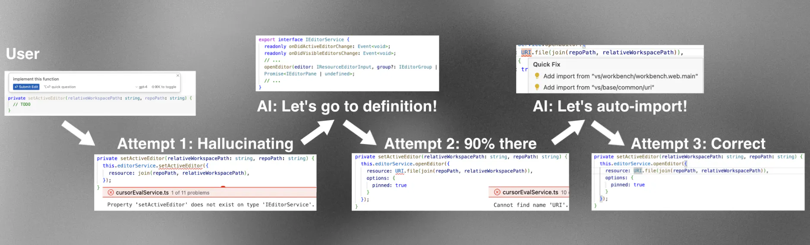

# Shadow workspace


[TOC]


# Disadvantages

1. 没有更改自己agent行为的能力，只是提供了一套合适的tool和env
2. IDE产品形态还没做到写代码和运行代码在上下文中交替进行


# Objective


Give AI remote access to the development environment, with the ability to see lints, go to definitions, and run code. But naively letting AIs run loose in our folder results in chaos


# Client-Code

In my local computer, it's 2023.5 version of cursor


# Design Criteria


G1: **LSP-usability**: the AIs should see lints from their changes, be able to go to definitions, and more generally be able to interact with all parts of the [language server protocol](https://microsoft.github.io/language-server-protocol/) (LSP).

G2: **Runnability**: the AIs should be able to run their code and see the output.

requirements:

1. **Independence**: the user's coding experience must be unaffected.
2. **Privacy**: the user's code should be safe (e.g. by having it all be local).
3. **Concurrency**: several AIs should be able to do their work concurrently.
4. **Universality**: it should work for all languages and all workspace setups.
5. **Maintainability**: it should be written with as little and as isolatable code as possible.
6. **Speed**: there should be no minute-long delays anywhere, and there should be enough throughput for hundreds of branches of AIs.


# LSP-Usability


Programming is along to context-constrained situations scenes



Almost all language servers can operate on files that aren't written to the file system, involving the file system makes things quite a bit more difficult.

> notes for vscode: In VS Code, every open file is represented by a `TextModel` object, which stores the current state of the file in memory. Language servers read from these text model objects instead of from disk, which is how they can give you completions and lints as you type (rather than just when you save).

## Simple soulution


Copy on write style updating for textmodel object.

```ts
async getLintsForChange(origFile: ITextModel, edit: ISingleEditOperation) {
  // create the copied in-memory TextModel and apply the AI edit to it
  const newModel = this.modelService.createModel(origFile.getValue(), null);
  newModel.applyEdits([edit]);
  // wait for 2 seconds to allow language servers to process the new TextModel object
  await new Promise((resolve) => setTimeout(resolve, 2000));
  // read the lints from the marker service, which internally routes to the correct extension based on the language
  const lints = this.markerService.read({ resource: newModel.uri });
  newModel.dispose();
  return lints;
}
```

Problem is: go-to-references results will include our copied file. 

> languages like Go that have a multi-file default namespace scope will complain about duplicated declarations for all functions both in the copied file *and* in the original file that the user may be editing, and languages like Rust where files are only included if they are explicitly imported somewhere else will not give you any errors at all.

You may think that these problems sound minor, but independence is absolutely critical for us. **If we degrade the normal experience of editing code even slightly, it won't matter how good our AI features are** — people, including myself, would just not use Cursor.

A few other **failing ideas**:

- spawning off our own `tsc` or `gopls` or `rust-analyzer` instances outside of the VS Code infrastructure
- duplicating the `extension host process`(VS Code中用于运行扩展程序的独立进程) where all VS Code extensions are run so that we can run two copies of each language server extension
- forking all popular language servers to support **multiple different versions of files** and then bundling those extensions into Cursor

## Shadow workspace implementation

每当AI想查看其编写的代码的代码格式检查（lints）时，我们会为当前工作区生成一个隐藏的窗口，然后在该窗口中进行编辑，并返回格式检查结果。我们在请求之间重复使用这个隐藏窗口。这样可以让我们（几乎）完全满足LSP的可用性，同时（几乎）完全满足所有要求。


(1) The AI proposes an edit to a file. 

(2) The edit is sent from the normal window's renderer process to its extension host, then over to the shadow window's extension host, and finally to the shadow window's renderer process. 

(3) The edit is applied inside the shadow window, hidden and independent from the user, and all lints are sent back the same way. 

(4) The AI receives the lint and decides how it wants to iterate.

AI is running in the renderer process of the normal window, **when it wants to see lints for the code that it wrote**, the renderer process asks the main process to spawn a hidden shadow window in the same folder.

Communication of the two renderer process: reuse the existing message port IPC from the renderer process to the extension host, then communicate from extension host to extension host using an independenet IPC connection. (Now can use gRPC and buf to communication)


# Achieving Runnability


Cursor目前短板: Implementing functions for you in the background while you use them, rather than **implementing entire PRs** 


