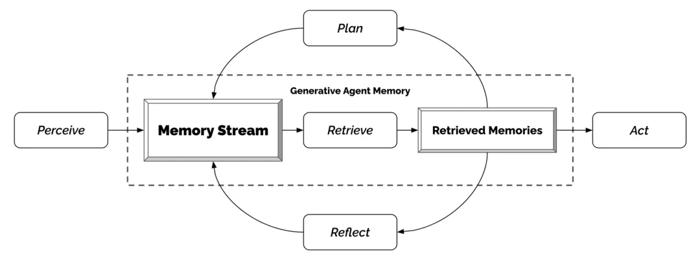
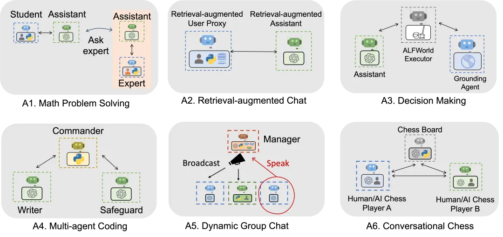
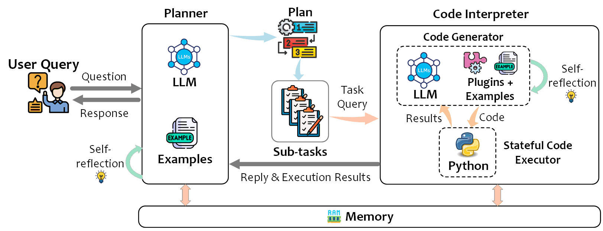

[TOC]

# Logic of survey

1. Establish a knowledge system and index to gain a general understanding of the field, so that related information can be added to our knowledge structure tree in the future.
2. Identify the key issues in each subfield, and determine the key benchmarks / metrics.
3. Understand the key details that we need to focus on (read the readme, code, and papers with questions in mind).

# Befor Read

**C1m** : the number of **C**ommits for recent **1** **m**onth, measure the activity of a repository

We do not account for projects that have not been updated for more than one month, or those projects that C1m less than 5.

The date of survey is July 4, 2024

# Agent

> An "agent" is anything that perceives and takes actions in the world -- wikipedia

The typical minimal operation process of an agent:

Perception -> Planning -> Action

# agent design pattern (WIP)

## single agent

1. ReAct(Reason + Act):

Reasoning Traces <--> LM <--(Actions then Observation)--> Env

2. Plan and Execute ReAct:

Divide user request to:

a. plan then generated tasks (DAG)

b. execute the DAG (use the LLM Compiler)

c. replan

## multi-agent

1. memory stream

All agents records are stored in a memory stream, then retrieve them when needed, then write/read the memory stream persistently

Factors to consider during the retrieval process:

- Recency
- Importance
- Relevance
- Reflection of LM

2. role-based, graph-based automaton

3. interprete to code then execute

a. Interpreter the user question to code snippets, then:

b. plan (divide and conquer) to sub-tasks,

c. all interpreter to python code then execute

# key features of agent

- autonomous
- continual learning
- persistent
- multimodal
- tool-create
- easy-to-debug
- multi-agent cooperation
- complex task solving (divide and conquer)
- **driving method (code, dsl, prompt, etc.)**

# key features of frameworks

- human-in-the-loop
- high-scalability
- app develop platform
- asnyc (和persistent)
- **duplex**
- local-friendly
- cloud-friendly
- multi-agent
- **rich-patterns**
- self-host language
- no-handcraft prompt
- include devops
- **support multi-task**
- **specific stream protocol**
- cryptographically secured
- rich toolkits

# agent build frameworks

| framework                                                                         | TAG                                                                                      | driven method            | supported by                                    | recommend reason                                                                                                                                                                                                                                                                               | C1m/Contributors | Star(k)/Fork(k)/PR/Issues |
| --------------------------------------------------------------------------------- | ---------------------------------------------------------------------------------------- | ------------------------ | ----------------------------------------------- | ---------------------------------------------------------------------------------------------------------------------------------------------------------------------------------------------------------------------------------------------------------------------------------------------- | ---------------- | ------------------------- |
| [sglang](https://github.com/sgl-project/sglang)                                      | self-host language                                                                       | prompt + custom compiler | stanford & UCBerkely students              | a structured generation language. High-Performance Backend Runtime co-designing the frontend and runtime system.                                                                                                                                                                   | 37 / 54          | 2.8 / 0.18 / 8 / 165      |
| [dspy](https://github.com/stanfordnlp/dspy)                                          | no-handcraft prompt                                                                      | optimizer                | stanfordnlp                                     | The framework for programming—not prompting models. algorithmically optimizing LM prompts and weights  paper: - Fine-Tuning and Prompt Optimization: Two Great Steps that Work Better Together                                                                            | 119 / 178        | 13.9 / 1.1 / 62 / 188     |
| [langchain](https://github.com/langchain-ai/langchain)                               | include devops self-host language go / js version                              | prompt + LCEL            | langchain-ai                                    | a comprehensive ecoysystem for build agent self-host language: LCEL                                                                                                                                                                                                                      | 573 / 2898      | 88.5 / 13.9 / 444 / 691   |
| [langgraph](https://github.com/langchain-ai/langgraph)                               | multi-agent workflow persistence async                                         | compiled graph + channel | langchain-ai                                    | a library for building stateful, multi-actor applications create controllable/persistent agent and multi-agent workflows                                                                                                                                                                 | 234 / 53         | 4.2 / 0.62 / 17 / 32      |
| [autogen](https://github.com/microsoft/autogen)                                      | multi-agent rich-patterns rich-toolkits                                        | prompt                   | microsoft                                       | a framework for building multi-agents to solve complex workflows support diverse conversation patterns                                                                                                                                                                                   | 67 / 310         | 28 / 4.1 / 114 / 526      |
| [agentUniverse](https://github.com/alipay/agentUniverse)                             | multi-agent rich-patterns                                                           | prompt + config          | alipay                                          | Rich Multi-Agent Collaboration Modes Seamless Integration of Domain Expertise rich plan methods (execute, nl2api, peer, rag, react, reviewing)                                                                                                                                       | 103 / 8          | 0.5 / 0.06 / 3 / 1        |
| [livekit/agents](https://github.com/livekit/agents)                                  | async                                                                                    | prompt                   | livekit                                         | an agent sdk for LiveKit WebRTC, used for real-time audio/video generate                                                                                                                                                                                                                      | 21 / 18          | 0.64 / 0.10 / 5 / 33      |
| [web-llm](https://github.com/mlc-ai/web-llm)                                         | in-browser local-friendly async                                                | prompt                   | mlc.ai                                          | leverages WebGPU for hardware acceleration, wihout server-side processing                                                                                                                                                                                                                     | 22 / 37          | 11.7 / 0.73 / 1 / 51   |
| [modelscope-agent](https://github.com/modelscope/modelscope-agent)                   | support async support rpc multi-agent (production level) high-scalability | prompt                   | alibaba Institutefor Intelligent Computing | a huggingface-like bridge with llm communities using ray to implement multi-agent mode for efficiency                                                                                                                                                                                     | 28 / 37          | 2.2 / 0.24 / 3 / 51       |
| [modelscope/agentscope](https://github.com/modelscope/agentscope?tab=readme-ov-file) | drag-style UI zero-code automatic prompt tuning                                |                          |                                                 |                                                                                                                                                                                                                                                                                                |                  |                           |
| [llama-agents](https://github.com/run-llama/llama-agents)                            | async-first multi-agent human-in-the-loop                                      | message queue            | LlamaIndex                                      | user <-> control plane <-> MQ <-> agents agents pull from MQ well-abstraction                                                                                                                                                                                                        | 51 / 6           | 0.83 / 0.06 / 3 / 18      |
| [TaskWeaver](https://github.com/microsoft/TaskWeaver)                                | easy-to-debug                                                                            | python code              | microsoft                                       | A code-first agent framework for seamlessly planning and executing data analytics tasks It consists of planner, code generator, code executor. easy to integrate with domain specific data / algorithm support stateful execution session management to separate user data | 6 / 24           | 5 / 0.64 / 6 / 29         |
| [dify](https://github.com/langgenius/dify)                                           | app development platform rich-toolkits                                              | prompt + workflow        | Dify.AI                                         | Coze like platform                                                                                                                                                                                                                                                                             | 310 / 286        | 36 / 4.9 / 46 / 271       |
| [Flowise](https://github.com/FlowiseAI/Flowise)                                      | just workflow, not agent                                                                 | workflow                 | FlowiseAI                                       | drag & drop UI to build LLM workflow                                                                                                                                                                                                                                                           | 39 / 118         | 27.2 / 14 / 33 / 377      |
| [mentals-ai](https://github.com/turing-machines/mentals-ai)                          | driven method(markdown)                                                                  | markdown                 | turingpi.com                                    | Agents in Markdown syntax (loops, memory and tools included).                                                                                                                                                                                                                                  | 0 / 2           | 0.25 / 0.02 / 1 / 9       |
| [InternLM/MindSearch](https://github.com/InternLM/MindSearch)                        | edit-workflow while running                                                              | python code              | intern-ai                                       | Multi-agent Framework of Web Search Engine It can edit the workflow while searching   [MindSearch: Mimicking Human Minds Elicits Deep AI Searcher](https://arxiv.org/abs/2407.20183)                                                                                          | 0 / 5            | 0.8 / 0.1 / 1 / 9         |
|                                                                                   |                                                                                          |                          |                                                 |                                                                                                                                                                                                                                                                                                |                  |                           |

# autonomous agent framework

| Project                                                 | TAG                                                                    | driven method                                                                                                               | supported by | recommend reason                                                                                              | C1m/Contributors | Star(k)/Fork(k)/PR/Issues |
| ------------------------------------------------------- | ---------------------------------------------------------------------- | --------------------------------------------------------------------------------------------------------------------------- | ------------ | ------------------------------------------------------------------------------------------------------------- | ---------------- | ------------------------- |
| [AutoGPT](https://github.com/Significant-Gravitas/AutoGPT) | autonomous                                                             | prompt                                                                                                                      | AutoGPT      | autonomously accomplish minor tasks thriving ui / cli ecosystem                                          | 40 / 722         | 164 / 43.4 / 17 / 50      |
| [aiwaves-cn/agents](https://github.com/aiwaves-cn/agents)  | autonomous agentic-multi-agent self-evolving                 | loss and backpropogation                                                                                                    | AIWaves      | Agent symbolic learning [Symbolic Learning Enables Self-Evolving Agents](https://arxiv.org/abs/2406.18532)  | 5 / 22           | 4.8 / 0.37 / 1 / 32       |
| [crewAI](https://github.com/joaomdmoura/crewAI)            | persistent multi-agent tool-create complex task solving | prompt + predefine task[metadata](https://github.com/joaomdmoura/crewAI/blob/main/src/crewai/cli/templates/config/agents.yaml) | crewAI       | enable AI agents like a well-oiled crew                                                                      | 47 / 98          | 16.8 / 2.3 / 44 / 412     |
| [llama-agents](https://github.com/run-llama/llama-agents)  | multi-agent async-first cloud-friendly                       | message queue                                                                                                               | llama-index  | async-first framework for building multi-agent systems, allowing for higher throughput and scalability. | 48 / 6           | 0.79 / 0.061 / 4 / 16     |
| [MemGPT](https://github.com/cpacker/MemGPT)                | long-term memory/state                                                 | predefined prompt                                                                                                           | community    | Create agents with long-term memory and custom tools                                                         | 24 / 27          | 10.7 / 1.2 / 14 / 246     |
| [uAgents](https://github.com/fetchai/uAgents)              | support decorates cryptographically secured async            | mail to every agents                                                                                                        | fetch.ai     | most secure agent framework create agents with simple and expressive decorators                         | 15 / 54          | 0.77 / 0.2 / 22 / 27      |

# programmer agent

key-features:

- AI Team
- devin-like (coding, debug, web browsing, terminal using)
- complex task solving
- vision-task
- meta-task
- IDE agent

key-benchmarks:

- [SWEBench](https://www.swebench.com/)
- 

| create-Date | Project                                                      | TAG                                       | supported by  | recommend reason                                             | C1m/Contributors | Star(k)/Fork(k)/PR/Issues |
| ----------- | ------------------------------------------------------------ | ----------------------------------------- | ------------- | ------------------------------------------------------------ | ---------------- | ------------------------- |
| 2023-09-03  | [ChatDev](https://github.com/OpenBMB/ChatDev)                | AI Team                                   | OpenBMB       | a virtual software company                                   | 18 / 50          | 24.3 / 3.1 / 14 / 19      |
| 2023-06-25  | [MetaGPT](https://github.com/geekan/MetaGPT)                 | AI Team                                   | community     | First AI Software Company                                    | 4 / 90           | 41.4 / 4.9 / 38 / 278     |
| 2024-05-10  | [OpenDevin](https://github.com/OpenDevin/OpenDevin)          | devin-like                                | community     | collaborate with human to write code, fix bugs, and ship features. | 242 / 156        | 28.3 / 3.2 / 32 / 142     |
| 2024-05-17  | [devika](https://github.com/stitionai/devika)                | devin-like                                | stition.ai    | agentic AI software Engineer. support dynamic agent state tracking and visualization | 2 / 43           | 17.8 / 2.3 / 41 / 108     |
| 2024-05-10  | [Devon](https://github.com/entropy-research/Devon)           | devin-like                                | community     | An open-source pair programmer                               | 169 / 12         | 2.3 / 0.17 / 7 / 14       |
| 2024-05-31  | [SWE-agent](https://github.com/princeton-nlp/SWE-agent)      | devin-like                                | princeton-nlp | It solves 12.47% of bugs in the SWE-bench evaluation set and takes just 1 minute | 45 / 46          | 11.9 / 1.2 / 8 / 56       |
| 2024-04-07  | [auto-coder-rover](https://github.com/nus-apr/auto-code-rover) | autonomous                                | community     | 30.67% (pass@1) in SWE-bench lite with each task costs less than $0.7 | 5 / 8            | 2.4 / 0.23 / 0 / 12       |
| 2023-09-24  | [plandex](https://github.com/plandex-ai/plandex)             | all-in-terminal                           | plandex-ai    | AI coding agent in terminal, designed for large, real-world tasks. | 37 / 15          | 9.8 / 0.7 / 3 / 23        |
| 2023-04-23  | [gpt-engineer](https://github.com/gpt-engineer-org/gpt-engineer) | just terminal tool                        | community     | an AI tool in terminal, minimal                              | 3 / 102          | 51.3 / 6.7 / 4 / 6        |
| 2023-04-09  | [auto-dev](https://github.com/unit-mesh/auto-dev)            | just IDE plugin                           | community     | powerful IDE plugin                                          | 28 / 16          | 2.6 / 0.3 / 0 / 7         |
| 2023-07-16  | [gpt-pilot](https://github.com/Pythagora-io/gpt-pilot)       | just IDE plugin                           | Pythagora     | pairprogrammer in vscode, to build realworld apps            | 44 / 44          | 29.1 / 2.9 / 12 / 205     |
| 2023-04-02  | [aider](https://github.com/paul-gauthier/aider)              | all-in-terminal                           | community     | multiple-files edit + git management + codding/debug + Q/A, like a real pair programmer | 268 / 31         | 12.7 / 1.2 / 13 / 77      |
| 2024-06-09  | [claude-dev](https://github.com/saoudrizwan/claude-dev)      | create whole project  IDE Agent | community     | reading & writing files creating projects executing terminal commands with your permission | 61 / 1           | 0.2 / 0.01 /              |
| 2024-02-11  | [vision-agent](https://github.com/landing-ai/vision-agent)   | vision-task meta-task                | landing-ai    | code-driven lots of vision tools can handle complex vision task (gen code from image) | 34 / 14          | 1.1 / 0.1 / 5 /1          |

# research agent

key features:

- support scraping
- keep track
- support local files

| framework                                                    | TAG                                                                                                   | driven method                              | supported by | recommend reason                                                                                                                                   | C1m/Contributors | Star(k)/Fork(k)/PR/Issues |
| ------------------------------------------------------------ | ----------------------------------------------------------------------------------------------------- | ------------------------------------------ | ------------ | -------------------------------------------------------------------------------------------------------------------------------------------------- | ---------------- | ------------------------- |
| [gpt-researcher](https://github.com/assafelovic/gpt-researcher) | autonomous async support scraping keep track support local files multi-agent | langgraph (json model) + predefined prompt | community    | solve the infinite loop problems by[plan-and-solve](https://arxiv.org/pdf/2305.04091) and parallelize works can generate whole research report | 40 / 52          | 13 / 1.6 / 9 / 29         |
| [AI-Scientist](https://github.com/SakanaAI/AI-Scientist)        | Automated                                                                                             |                                            | SakanaAI     | from idea -> paper, full workflow                                                                                                                  | / 7              | 5.5 / 0.7 /  15 / 1      |

# UI-focus Agent

## browser-focus agent

key features:

- support local model

key benchmark:

| Project                                                     | TAG                                                                    | driven method        | supported by | recommend reason                                                                                                                                                                        | C1m/Contributors | Star(k)/Fork(k)/PR/Issues |
| ----------------------------------------------------------- | ---------------------------------------------------------------------- | -------------------- | ------------ | --------------------------------------------------------------------------------------------------------------------------------------------------------------------------------------- | ---------------- | ------------------------- |
| [skyvern](https://github.com/Skyvern-AI/skyvern)               | autonomous multimodal manipulate-browser cloud-friendly | dom + Prompt + image | skyvern      | interact with websites using browser automation support to run multiple instances in parallel to automate workflows at scale  can even surpass CAPTCHA Authentication | 93 / 14          | 5.4 / 0.39 / 3 / 15       |
| [webllama](https://github.com/McGill-NLP/webllama)             | support local model                                                    |                      | community    | Their first model[`Llama-3-8B-Web`](https://huggingface.co/McGill-NLP/Llama-3-8B-Web), surpasses GPT-4V (`*`zero-shot) by 18% on [`WebLINX`](https://mcgill-nlp.github.io/weblinx/)    | 3 / 2            | 1.3 / 0.1 / 0 / 3         |
| [Agent-E](https://github.com/EmergenceAI/Agent-E)              | search like 2                                                          |                      | EmergenceAI  | provided by the[AutoGen agent framework](https://github.com/microsoft/autogen) It can solve complex problem                                                                           | 44 / 6           | 0.6 / 0.1 / 5 / 7         |
| [npi-ai/npi](https://github.com/npi-ai/npi?tab=readme-ov-file) | python code as tool integration                                        |                      |              | multi useful demo shows its potential                                                                                                                                                   |                  |                           |

## PC-focus agent

key features:

multi-agent

rich skillsets(mouse, keyboard, native-API, copilot)

support custom app-agent

key benchmark:

| Project                                                                        | TAG                                             | driven method | supported by     | recommend reason                                                                                                                        | C1m/Contributors | Star(k)/Fork(k)/PR/Issues |
| ------------------------------------------------------------------------------ | ----------------------------------------------- | ------------- | ---------------- | --------------------------------------------------------------------------------------------------------------------------------------- | ---------------- | ------------------------- |
| [UFO](https://github.com/microsoft/UFO)                                           |                                                 |               | microsoft        |                                                                                                                                         | 94 / 13          | 6.4 / 0.77 / 3 / 6        |
| [OS-Copilot](https://github.com/OS-Copilot/OS-Copilot)                            | focus-mode record effort  gen-webpage |               | community        |                                                                                                                                         | 0 / 8            | 1.4 / 0.15 / 3 / 9        |
| [Cradle](https://github.com/BAAI-Agents/Cradle)                                   |                                                 |               | BAAI             | first attempt at General Computer Control (GCC)                                                                                         | 15 / 14          | 0.65 / 0.07 / 0 / 1       |
| [ScreenAgent](https://github.com/niuzaisheng/ScreenAgent)                         |                                                 |               | Jilin University | support GPT4-V, LLaVa-1.5, CogAgent                                                                                                     | 4 / 1            | 0.2 / 0.02 / 0 / 16       |
| [self-operating-computer](https://github.com/OthersideAI/self-operating-computer) |                                                 |               | OthersideAI      | already has product:[link](https://www.hyperwriteai.com/self-operating-computer)                                                           | 0 / 24           | 8.2 / 1.1 / 8 / 54        |
| [OpenAgents](https://github.com/xlang-ai/OpenAgents)                              |                                                 |               | xlang-ai         | an open platform for using and hosting language agents in the wild of everyday life contains: plugins agent, web agent, data agent | 1 / 16           | 3.7 / 0.4 / 3 / 11        |

## app-focus agent

key features:

key benchmark:

| Project                                           | TAG         | driven method | supported by       | recommend reason | C1m/Contributors | Star(k)/Fork(k)/PR/Issues |
| ------------------------------------------------- | ----------- | ------------- | ------------------ | ---------------- | ---------------- | ------------------------- |
| [AutoDroid](https://github.com/MobileLLM/AutoDroid)  |             |               | communiy           |                  | 0 / 3            | 0.2 / 0.03 / 1 / 7        |
| [MoblieAgent](https://github.com/X-PLUG/MobileAgent) | multi-agent |               | alibaba            |                  | 30 / 5           | 2.3 / 0.2 / 1 / 18        |
| [AppAgent](https://github.com/mnotgod96/AppAgent)    |             |               | communiy / tencent |                  | 0 / 5            | 4.6 / 0.49 / 5 / 65       |

# agent as OS

key features:

- virtual context
- resouce optimize
- concurrent
- access control
- rich toolkits

key benchmark:

- concurrent execution time (scheduled)

| Project                                      | TAG                                                               | driven method                                                                                                                           | supported by | recommend reason                                                                                                                                                                                                                   | C1m/Contributors | Star(k)/Fork(k)/PR/Issues |
| -------------------------------------------- | ----------------------------------------------------------------- | --------------------------------------------------------------------------------------------------------------------------------------- | ------------ | ---------------------------------------------------------------------------------------------------------------------------------------------------------------------------------------------------------------------------------- | ---------------- | ------------------------- |
| [AIOS](https://github.com/agiresearch/AIOS)     | resource optimize (FIFO, LRU) concurrent access control | prompt + human command                                                                                                                  | community    | LLM as the brain of OS context -- llm kernel -- memory -- storage -- scheduler  self-host system calls, see also [OpenAGI: Package for AI Agent creation](https://github.com/agiresearch/OpenAGI?tab=readme-ov-file) | 17 / 20         | 2.9 / 0.3 / 0 / 7         |
| [MemGPT](https://github.com/cpacker/MemGPT)     | virtual context                                                   | predefined prompt (natural languge) look [system-prompts](https://github.com/cpacker/MemGPT/tree/main/memgpt/prompts/system)         | community    | It manages a virtual context to create unbounded LLM context prompt tokens: [system instructions] + [working context] + [FIFO Queue]                                                                                          | 28 / 90          | 10.7 / 1.2 / 15 / 249     |
| [phidata](https://github.com/phidatahq/phidata) | rick toolkits multimodal                                     | predefined prompt (natural languge) look [assistant.py](https://github.com/phidatahq/phidata/blob/main/cookbook/llm_os/assistant.py) | phidata      | memory + knowledges + rich tools                                                                                                                                                                                                   | 46 / 37          | 10.5 / 1.5 / 21 / 48      |
|                                              |                                                                   |                                                                                                                                         |              | using to self-improvement                                                                                                                                                                                                          |                  |                           |

# Embodied Agent

key features:

- voice-generate
- persistent
- vision
- create 3D-printable parts
- 

| Project                                 | TAG                                                                       | driven method | supported by | recommend reason                                                                                                          | C1m/Contributors | Star(k)/Fork(k)/PR/Issues |
| --------------------------------------- | ------------------------------------------------------------------------- | ------------- | ------------ | ------------------------------------------------------------------------------------------------------------------------- | ---------------- | ------------------------- |
| [GlaDOS](https://github.com/dnhkng/GlaDOS) | voice-generate persistent vision create 3D-printable parts |               | Valve        | Personality Core for GLaDOS, the first steps towards a real-life implementation of the AI from the Portal series by Valve | 21 / 13          | 2.8 / 0.26 / 1 / 11       |

# Agent Platform

key features:

| Project                                     | TAG | supported by | recommend reason                                                                                                                                                       | C1m/Contributors | Star(k)/Fork(k)/PR/Issues |
| ------------------------------------------- | --- | ------------ | ---------------------------------------------------------------------------------------------------------------------------------------------------------------------- | ---------------- | ------------------------- |
| [OSWorld](https://github.com/xlang-ai/OSWorld) |     | xlang-ai     | Benchmarking Multimodal Agents for Open-Ended Tasks in Real Computer Environments  can also test expected time and budget cost, around 10 - 30h, 100$ around | 17 / 18          | 1 / 0.12 / 0 / 4          |
|                                             |     |              |                                                                                                                                                                        |                  |                           |

# *AIGC-centric software architecture

key features:

- distributed

| Project                                          | TAG         | supported by | recommend reason                                                             | C1m/Contributors | Star(k)/Fork(k)/PR/Issues |
| ------------------------------------------------ | ----------- | ------------ | ---------------------------------------------------------------------------- | ---------------- | ------------------------- |
| [unit-mesh](https://github.com/unit-mesh/unit-mesh) | distributed | community    | AIGC-centric distributed software architecture unit are generated by AI | 0 / 3            | 0.18 / 0.02 / 0 / 0       |
|                                                  |             |              |                                                                              |                  |                           |

# *Embodied Hardware

OpenGlass - Open Source Smart Glasses [Github](https://github.com/BasedHardware/OpenGlass)
Turn any glasses into hackable smart glasses with less than $25 of off-the-shelf components

# Prgramming Language

| Project                                                    | desc                                                         |      | star (k) |
| ---------------------------------------------------------- | ------------------------------------------------------------ | ---- | -------- |
| [ell](https://github.com/MadcowD/ell)                      | A language model programming framework.                      |      | 1        |
| [appl](https://github.com/appl-team/appl)                  | A Prompt Programming Language                                |      | 0.06     |
| [lmql](https://github.com/eth-sri/lmql?tab=readme-ov-file) | A language for constraint-guided and efficient LLM programming |      | 3.6      |
| [marsha](https://github.com/alantech/marsha)               | a functional, higher-level, English-based programming language that gets compiled into tested Python software by an LLM |      | 0.46     |

