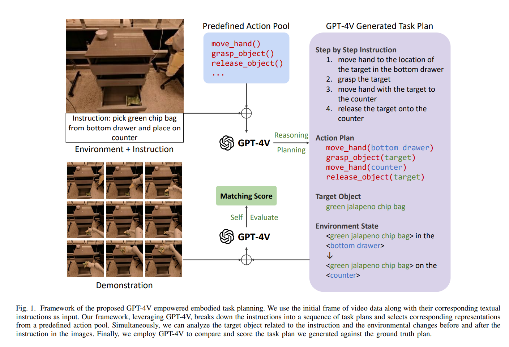

In the academic communit, research of agent can be divided into:

references:

- https://github.com/lafmdp/Awesome-Papers-Autonomous-Agent
- https://github.com/hyp1231/awesome-llm-powered-agent?tab=readme-ov-file#general-reasoning--planning--tool-using

# Agent History

https://zhuanlan.zhihu.com/p/665644399

# LLM For Robotics

The prompt architecture:

disadvantage: can't create action

embodied agent history:

reference: Building Cooperative Embodied Agents Modularly with Large Language Models (ICLR2024)

# Multi-Agent cooperation

| date       | paper                                                                                                                                 | desc                                           | code (stars k)                                                                    | main author                                                                                                                                         | institution |
| ---------- | ------------------------------------------------------------------------------------------------------------------------------------- | ---------------------------------------------- | --------------------------------------------------------------------------------- | --------------------------------------------------------------------------------------------------------------------------------------------------- | ----------- |
| 2024-06-07 | [Mixture-of-Agents Enhances Large Language Model Capabilities](https://arxiv.org/abs/2406.04692)                                         | outperforms GPT-4                              | [MoA](https://github.com/togethercomputer/MoA) (1.9)                                | [Junlin Wang](https://arxiv.org/search/cs?searchtype=author&query=Wang,+J), [Jue Wang](https://arxiv.org/search/cs?searchtype=author&query=Wang,+J)       | together.ai |
| 2024-05-22 | [Scalable Multi-Robot Collaboration with Large Language Models: Centralized or Decentralized Systems?](https://arxiv.org/abs/2309.15943) | explain the communication mode of multiu-agent | [multi-agent-framework](https://github.com/yongchao98/multi-agent-framework) (0.01) | [Yongchao Chen](https://arxiv.org/search/cs?searchtype=author&query=Chen,+Y), [Jacob Arkin](https://arxiv.org/search/cs?searchtype=author&query=Arkin,+J) | MIT         |

# Eval

https://www.swebench.com/

# LLM-Based OS

https://github.com/samholt/l2mac

# Cost control

[AI Agents That Matter](https://arxiv.org/abs/2407.01502): 2024-07-01

# Key features of a embodied-agent

- **Plan**: Long horizon tasks, like "can you make me a coffee"
- **Reinforcement learning**: Policy correction via human feedback
- **Imitation Learning**: updating the action library
- **Continual Learning**: adapting to a changing environment
- **Remote supervisory control**:

Updating the action library with imitation learning

---

| date | paper | desc | code (stars) | main author | institution |
| ---- | ----- | ---- | ------------ | ----------- | ----------- |
