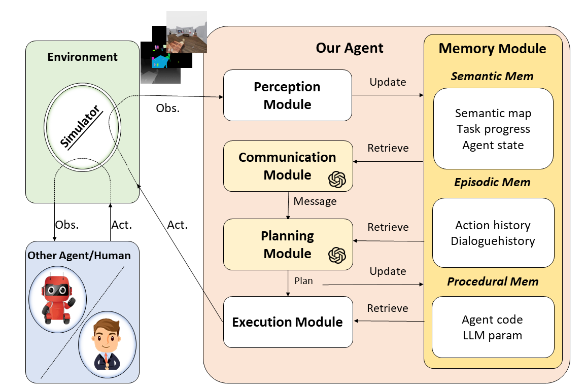

In the academic communit, research of agent can be divided into:

- RL-based Agent
  - Instruction following
  - Language as knowledge
  - World model
  - LLM as tool
  - Generalization ability
  - Continual learning
  - RL + LLM
  - Trajectory to language
  - Trajectory predication
  - Others
- LLM-based Agent
  - multimodal
  - General Reasoning & planning & Tool using
  - 
  - Task-specific
  - Multi-Agent cooperation
  - Experimental analysis
  - Benchmark & Dataset
  - Application
  - Algorithm design
  - Others
- 

references:

- https://github.com/lafmdp/Awesome-Papers-Autonomous-Agent
- https://github.com/hyp1231/awesome-llm-powered-agent?tab=readme-ov-file#general-reasoning--planning--tool-using

# Agent History

https://zhuanlan.zhihu.com/p/665644399

# LLM For Robotics

The prompt architecture:

disadvantage: can't create action

embodied agent history:

reference: Building Cooperative Embodied Agents Modularly with Large Language Models (ICLR2024)

# Multi-Agent cooperation

https://arxiv.org/pdf/2309.15943

# Eval

https://www.swebench.com/

# LLM-Based OS

https://github.com/samholt/l2mac

# Key features of a embodied-agent

- **Plan**: Long horizon tasks, like "can you make me a coffee"
- **Reinforcement learning**: Policy correction via human feedback
- **Imitation Learning**: updating the action library
- **Continual Learning**: adapting to a changing environment
- **Remote supervisory control**:

Updating the action library with imitation learning
