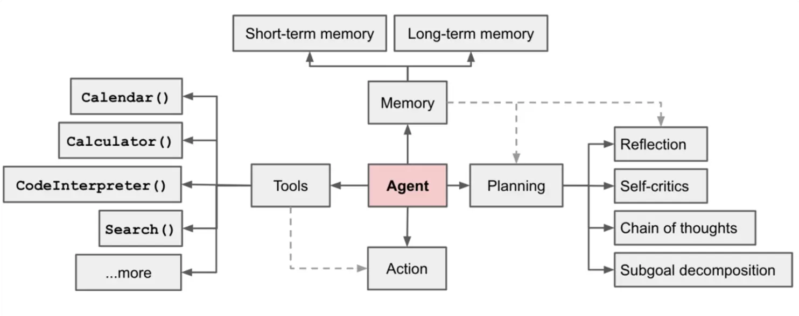
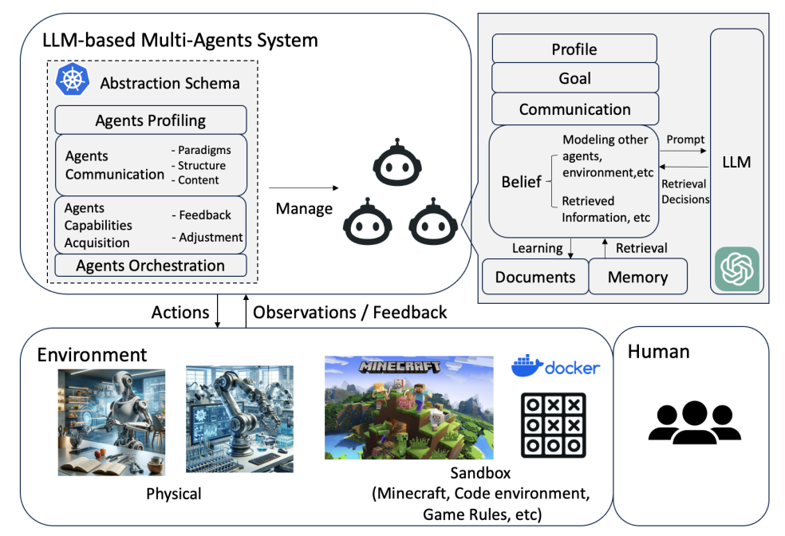
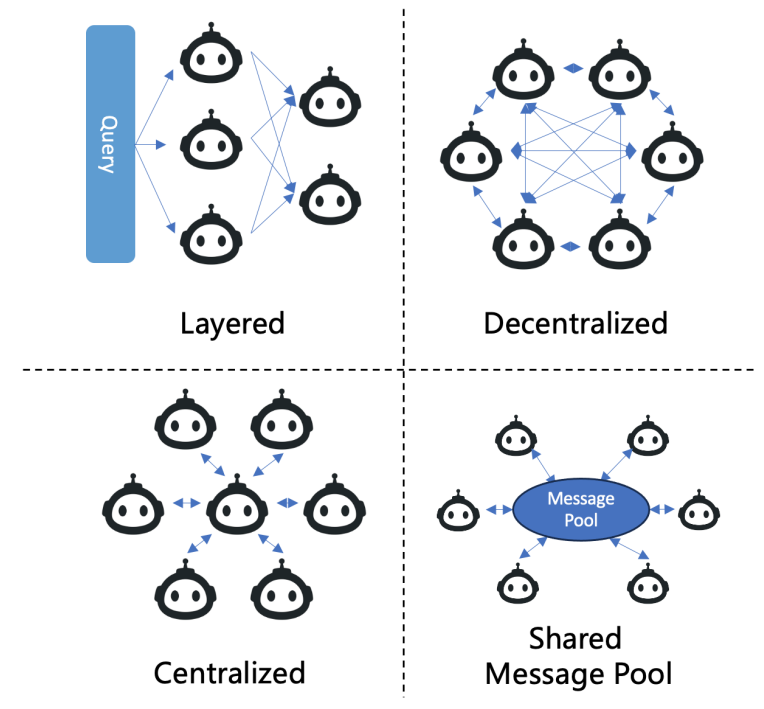

LLM-MA, MARL

# Background

Single Agent: Thought + Tool + Memory

Multi Agent: 

# Framework

## key aspects

### profiling

Predefined / Model-generated / Derived from pre-existing datasets

### communication

Paradigms:
Cooperative, Debate, Competitive

Struture:

### capability acquisition
Feedback, Strategies, adjust behavior

Feedback: Environment, Agent interactions, Human feedback
Adjustment: Memory, Self-evolution, Dynamic generation new agents

# Application

## Problem Solving

### Software Development

### AutoML

### AI Scientist

### Embodied Agents

## World Simulation

### Society Simulation
Aiming to explore potential social dynamics and propagation

### Multi-Robot Systems

### Policy Simulation

### Game Simulation

# Datasets and Benchmarks

