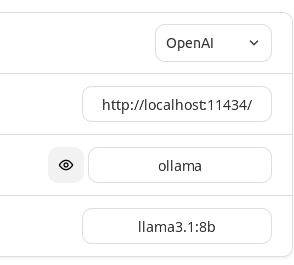

run ollama:

```shell

# customize the model directories
export OLLAMA_MODELS=/home/llm/.ollama/models

# use 0.0.0.0 rather than localhost, otherwise other device in same LAN cant access it
OLLAMA_HOST=0.0.0.0 OLLAMA_ORIGINS=* ollama serve

# show the prompt in log
OLLAMA_DEBUG="1" OLLAMA_HOST=0.0.0.0 OLLAMA_ORIGINS=* ollama serve
```

now, the path of models is located in: /usr/share/ollama/.ollama/models

PS: all args in 'ollama serve':

```go
    envVars["OLLAMA_DEBUG"],
    envVars["OLLAMA_HOST"],
    envVars["OLLAMA_KEEP_ALIVE"],
    envVars["OLLAMA_MAX_LOADED_MODELS"],
    envVars["OLLAMA_MAX_QUEUE"],
    envVars["OLLAMA_MODELS"],
    envVars["OLLAMA_NUM_PARALLEL"],
    envVars["OLLAMA_NOPRUNE"],
    envVars["OLLAMA_ORIGINS"],
    envVars["OLLAMA_TMPDIR"],
    envVars["OLLAMA_FLASH_ATTENTION"],
    envVars["OLLAMA_LLM_LIBRARY"],
    envVars["OLLAMA_MAX_VRAM"],

```

# update ollama settings

```shell
sudo vim /etc/systemd/system/ollama.service

# notice: replace the user from 'ollama' to '<current user>', otherwise it might can not connect to ollama app after execute next two commands:

sudo systemctl daemon-reload
sudo systemctl restart ollama
```


# stop ollama:

```shell
sudo systemctl stop ollama.service

```

show models:

```shell
ollama list
```

# update client

update ollama (when run some latest models but get error):

first stop the ollama

```shell
# replace the version to target version
curl https://ollama.com/install.sh | sed 's#https://ollama.com/download#https://github.com/jmorganca/ollama/releases/download/v0.3.10#' | sh
```

access by OPENAI-Compatible API:


# stream API

POST method:

```shell
# the model here is llama3
curl http://localhost:11434/api/generate -d '{
  "model": "llama3",
  "prompt": "Why is the sky blue?"
}'
```

# not-stream API

POST method:

```shell
# the model here is llama3
curl http://localhost:11434/v1/chat/completions \
    -H "Content-Type: application/json" \
    -d '{
        "model": "ds-r1-1.58b-4gpu:latest",
        "messages": [
            {
                "role": "system",
                "content": "You are a helpful assistant."
            },
            {
                "role": "user",
                "content": "Hello!"
            }
        ]
    }'
```

compatible for other library:

```shell
$ export OPENAI_API_BASE='http://localhost:11434/v1'
$ export OPENAI_API_KEY='ollama'

# with aider
$ docker run -it --volume $(pwd):/app paulgauthier/aider --openai-api-key $OPENAI_API_KEY
```

# text model API

```
import base64
from openai import OpenAI

client = OpenAI(
    base_url = 'http://localhost:11434/v1',
    api_key = 'ollama',  # required, but unused
)

response = client.chat.completions.create(
    model = "r1-2_51bit:latest",
    messages = [
        {
            "role": "user",
            "content": [
                {
                    "type": "text",
                    "text": "你的身份是微博的资深评论段子手，结合如下评论指南和博文信息，如何在15个字以内趣味评论该博文且有对话感？\n\n**评论指南**\n1.结合微博内容(content)、类型(blog_type)、配图(image)、领域(tagname)、性别(gender)构建评论内容，确保评论和博文、配图主题一致\n2.保持评论友好和积极，提供情绪价值\n3.评论要**真实且让人有互动的欲望**，**适度幽默有梗**\n4.**严禁发布带色情、涉政的敏感内容**\n5.不要提及特定身份和角色，不要提及“博主” \n\n**博文信息**：{\"content\": \"世界上最疼我的两个人，\\n我最爱的姥姥和奶奶，\\n已经离开我四年了，\\n您们在那边过得还好吗？[泪] ​\", \"blog_type\": \"picture\", \"gender\": \"男\", \"tagname\": \"情感\", \"author_nick\": \"破厂皮老师\", \"author_description\": \"\", \"author_region\": \"发布于 内蒙古\", \"image caption\": \"这张图片由两张照片拼接而成。左边的照片中，一位老人和一位年轻人坐在沙发上，老人双手托着脸颊，显得有些疲惫或沉思。老人穿着深色的衣服，头发花白，脸上有明显的皱纹和斑点。年轻人穿着蓝色的上衣，戴着眼镜，表情平静。沙发上有花纹的靠垫，背景是白色的墙壁。\n\n右边的照片中，同样的老人和年轻人坐在一起，但他们的表情和姿势有所不同。老人穿着红色的衣服，戴着眼镜，表情温和，似乎在微笑。年轻人穿着蓝色的上衣，戴着眼镜，表情自然，似乎在微笑。背景是白色的墙壁，光线明亮。\n\n两张照片的拼接使得整体看起来像是经过编辑处理的，但两张照片中的场景和人物表情都显得自然和谐。\"}"
                }
            ],
        }
    ]
)

print(response.choices[0].message.content)
```


# Vision model API

use the vision model:

- in cli:

```
$ ollama run llava-llama3:8b-v1.1-fp16
>>> extract text from img and notice keep indent and newline: ./Downloads/github-img-8.png
Added image './Downloads/github-img-8.png'
demo package

Module contents
------------------

class demo . foo ("a" class demo_base) : object Some headers line Variables: Somevar - some text some detailed 
docstring demo .Somevar = j Documentation for this variable
```

- in python client (need ollama version >= 0.2.6)

```python
import base64
from openai import OpenAI


def encode_image(image_path):
  with open(image_path, "rb") as image_file:
    return base64.b64encode(image_file.read()).decode('utf-8')


client = OpenAI(
    base_url = 'http://localhost:11434/v1',
    api_key = 'ollama',  # required, but unused
)

base64_image = encode_image("/home/llm/Downloads/github-img-8.png")

response = client.chat.completions.create(
    model = "llava-llama3:8b-v1.1-fp16",
    messages = [
        {"role": "system", "content": "You are a helpful assistant."},
        {
            "role": "user",
            "content": [
                {
                    "type": "text",
                    "text": "extract text from img and notice keep indent and newline"
                },
                {
                  "type": "image_url",
                  "image_url": {
                    "url": f"data:image/jpeg;base64,{base64_image}",
                  },
                }
            ],
        }
    ]
)

print(response.choices[0].message.content)
```

# the model files location

~/.ollama/models

or

/usr/share/ollama/.ollama/models

# template


we can see template of models in ollama: eg: https://ollama.com/library/llama3.1:latest/blobs/11ce4ee3e170


# backend

llama.cpp

# frontend

## NextChat


