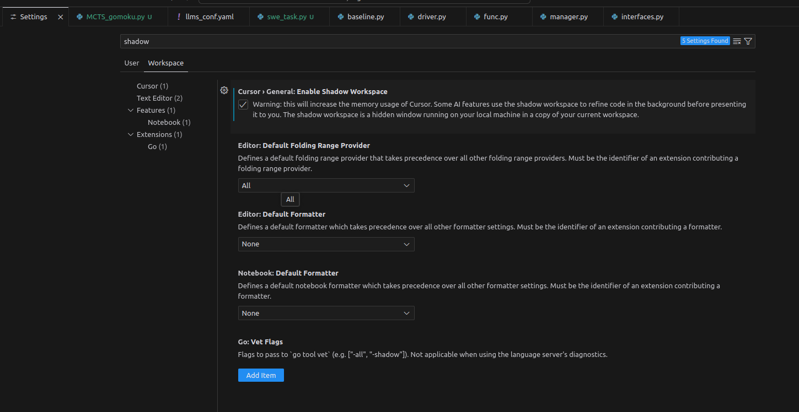

# Shortcuts

Ctrl + P: search file, like 【shift】 【shift】 in jetbrains

Ctrl + Shift + P: input command

Ctrl + L: Open the chat tab

Ctrl + , : Open vscode settings

Ctrl + J: Open/Hide bottom panel

Ctrl + I: Open chat with Composer

Ctrl + Shift + I: Open Composer page

Hover on a file/function/class/var name, then 【F2】: refactor it's name

# Ignore files

put .cursorignore on the root level of project

then edit it like .gitignore

# Shadow Workspace

open the vscode settings, then check the box

# Composer

# Tips

- Always create a new project in an empty folder
- When express demand, be explicit, but not too much explicit
- Let it write readme at first, be a long term memory
- Write NL outline while programming
- Using git to manage versions. When at some success **checkpoint**, add commit. 
- Ctrl + I start composer to write something, using '**save all**' firstly, rather than 'accept all'. because if cursor failed, we can reject all
- Using @codebase.
- @<frequent QA doc links>
- Rules for AI, like system prompt. Set my perference for programming and language
- Delete account then register, avoid paying for premium.

# Extensions

# Future

1. I’m wondering if there is a potential there to let it access DevTools and the browser window in the future. If the AI could also see the Elements, Styles, Network panel and take screenshots of the UI, this would make it very powerful.

2. 