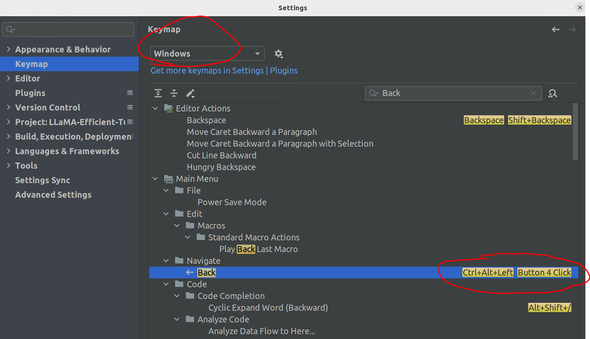
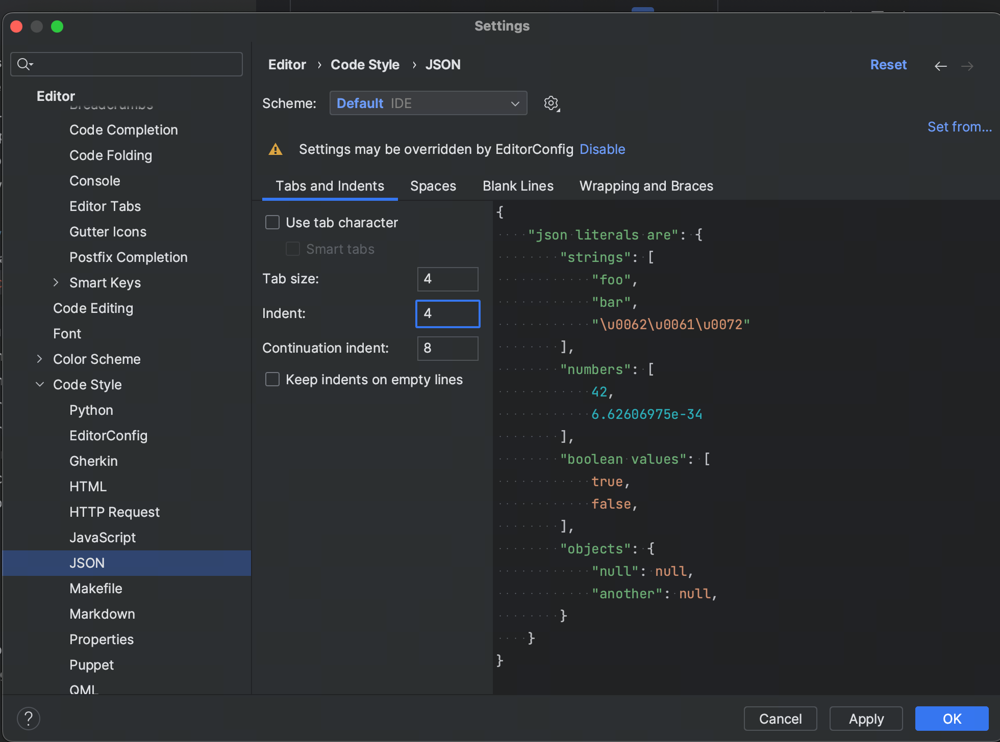

# 通用

## 创建shortcup (ubuntu)

PyCharm can create it's own launcher icon (but it's not created by default).

All you have to do is:

1. Start PyCharm.
2. From the Tools menu, select "Create Desktop Entry..."
3. Tick the corresponding box if you want the launcher for all users.
4. If you selected "Create entry for all users", you will be asked for your password.
5. You should then be able to find PyCharm in the Unity Dash or pin it to the launcher.
   Note: You may need a system restart before it appears.

## 快捷键

跳转到上一次看代码的位置:

- 直接在【settings】→【keymap】中搜索Back或者Navigate

根据对应操作系统，看到对应快捷键



Windows: 【Ctrl】+【Alt】+【Left】

Linux: 【Alt】+【Shift】+【Left】


一个文件内：expand / folding code

ubuntu:

expand:【ctrl】+【shift】+【+】

collapse:【ctrl】+【shift】+【-】


## 问题修复

### [Error while opening Intellij IDEA due to an already running process](https://stackoverflow.com/questions/77003028/error-while-opening-intellij-idea-due-to-an-already-running-process)

问题原因：IDE不正常关闭，导致之前的锁文件没有被删除

解决：

Linux:

```
~/.config/JetBrains/IntelliJIdea2023.2

```

Windows:

```
C:\Users\JohnS\AppData\Roaming\JetBrains\IntelliJIdea2023.2

```

macOS:

```
~/Library/Application\ Support/JetBrains/IntelliJIdea2023.2
```

使用

`find ~/ -type f -name '.lock'`

删除锁文件，即可

# Pycharm

## 查找代码

Python主要是动态类型，所以会比较麻烦，有一些查找代码的专属技巧

1. 已知类路径查找代码

已知类名如service.callbacks.log_callback.LogCallback，怎么快速查找对应类呢?

【Shift】+【Shift】，输入这个，就能找到了。

## 生成注释

1. 如果在函数定义下按""" 再按回车无法自动生成注释，这样解决:


## 修改报错颜色

【settings】，然后:


## 控制台自动换行


## JSON 缩进


