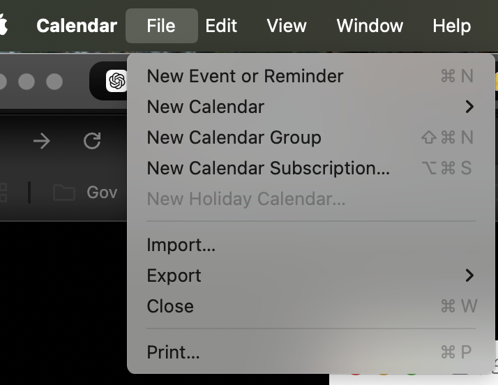

# MacOS

macOS官方使用手册:

[https://support.apple.com/zh-cn/guide/mac-help/welcome/mac](https://support.apple.com/zh-cn/guide/mac-help/welcome/mac)

## 下载被阻止的文件

当有弹出框说阻止安装某个来历不明的文件，但我们希望继续安装时：

在这里会弹出一个菜单出来，然后我们点击仍然/继续的选项

## 常用快捷键

任务管理器: <command> + <option> + <esc> ，可以强制退出程序
截图并复制到clipboard: <control> + <command> + <shift> + 4
关闭当前窗口，但不退出: <command> + w
关闭并退出当前窗口: <command> + q

## Calendar

add chinese holiday:   

Choose 【New Calendar Subscription】   
输入:   
webcal://p10-calendars.icloud.com/holiday/CN_zh.ics

reference:
other holiday of the world:
https://www.ius7.com/a/388