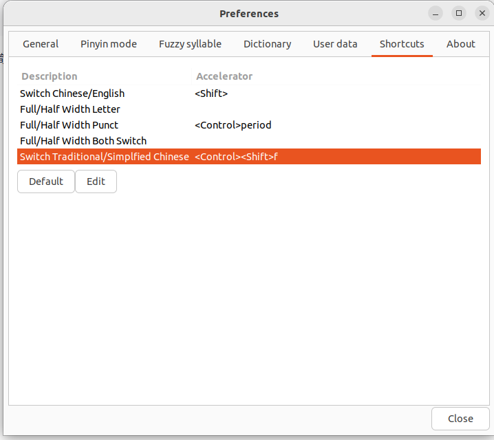

# 中文输入法安装

*Note: These instructions are ONLY meant for vanilla Ubuntu and ONLY for 22.04 for basic pinyin input for simplified characters.*

Ubuntu has never provided an easy, well-documented option for adding pinyin input support. However, to get basic pinyin support in 22.04 you can simply:

1. Open Settings, go to Region & Language -> Manage Installed Languages -> Install / Remove languages.
2. Select Chinese (Simplified). Make sure Keyboard Input method system has Ibus selected. Apply.
3. Reboot
4. Log back in, reopen Settings, go to Keyboard.
5. Click on the "+" sign under Input sources.
6. Select Chinese (China) and then Chinese (Intelligent Pinyin).

You should now have a little "en" (or whatever the language code of your Ubuntu install is) at the top right of your main screen which you can click on and get a list of available input methods, including Chinese (Intelligent pinyin). Open anything that can receive text (like gedit, openoffice, vim, FF,...) and try it out. You can also change between them with Super/Win + space.

1. Reboot to make sure it is still there after a reboot.
2. Be happy that you didn't lose any more time on this ridiculously trivial issue that is still a massive pain in 2022!

*If you don't need extra bells and whistles then do NOT bother with fcitx (and the supposedly excellent "google pinyin"), uim or any other exotic option! They are extremely hit-and-miss trying to install, and finding a guide that is relevant to 22.04 is almost impossible. Some claim to have "tested with 22.04" but they have done upgrades of previous versions that they had working, not fresh installs.*

可以先安装中文版操作系统，再改语言为英文版，这样是最方便的

# 禁用ctrl + shift + f

输入法的简繁转换，得把它禁掉，不然intellij idea里会有冲突

点击输入法图标，进入preferences



edit，把所有勾选的框和文本框都删掉，close即可

# 截图工具安装

`apt install flameshot`

这里选择flameshot

[https://github.com/flameshot-org/flameshot](https://github.com/flameshot-org/flameshot)

注意看On ubuntu这段:

To use Flameshot instead of the default screenshot application in Ubuntu we need to remove the binding on Prt Sc key, and then create a new binding for /usr/bin/flameshot gui ([adaptated](https://askubuntu.com/posts/1039949/revisions) from [Pavel's answer on AskUbuntu](https://askubuntu.com/revisions/1036473/1)).

1. Remove the binding on Prt Sc:

Ubuntu 22.04: Go to *Settings* > *Keyboard* > *View and Customise Shortcuts* > *Screenshots* > *Take a screenshot interactively* and press backspace

1. Add custom binding on Prt Sc:

Ubuntu 22.04: Go to *Settings* > *Keyboard* > *View and Customise Shortcuts* > *Custom shortcuts* and press the '+' button at the bottom.

Name the command as you like it, e.g. flameshot. And in the command insert:

 `/usr/bin/flameshot gui` Then custom the shortkut keys.


# screen recorder

start recorder: Ctrl + Shift + Alt + R

end recorder: Ctrl + Shift + Alt + R


# webcam driver 安装

这里以Logitech C270hd为例

```bash
sudo apt install cheese
```

```bash
xiaoyi@xiaoyi-pc:~$ ls -ltrh /dev/video*
crw-rw----+ 1 root video 81, 1 May 14  2024 /dev/video1
crw-rw----+ 1 root video 81, 0 May 14  2024 /dev/video0
```

```bash
cheese -d /dev/video2
```

# nautilus-terminal

可以在文件夹中出现 “open in terminal”

```bash
sudo apt install nautilus-extension-gnome-terminal
```

# 快捷键修改

ubunt快捷键占用解绑:

```bash
# 查看switch-to-workspace left是否包含 <Control><Alt>Left
$ gsettings get org.gnome.desktop.wm.keybindings switch-to-workspace-left
['<Super>Page_Up', '<Super><Alt>Left', '<Control><Alt>Left']
# 删除'<Control><Alt>Left'
$ gsettings set org.gnome.desktop.wm.keybindings switch-to-workspace-left "['<Super>Page_Up', '<Super><Alt>Left']"
# 重新查看
$ gsettings get org.gnome.desktop.wm.keybindings switch-to-workspace-left
['<Super>Page_Up', '<Super><Alt>Left', '<Control><Alt>Left']

# 查看switch-to-workspace right是否包含<Control><Alt>Right
$ gsettings get org.gnome.desktop.wm.keybindings switch-to-workspace-right
['<Super>Page_Down', '<Super><Alt>Right', '<Control><Alt>Right']
# 删除 '<Control><Alt>Right'
$ gsettings set org.gnome.desktop.wm.keybindings switch-to-workspace-right "['<Super>Page_Down', '<Super><Alt>Right']"
# 重新查看
$ gsettings get org.gnome.desktop.wm.keybindings switch-to-workspace-right
['<Super>Page_Down', '<Super><Alt>Right']

```

jetbrains IDE里修改:


【Keymap】 → 输入【navigation】

把Alt+Shift+Left/Right 改为 Ctrl+Alt+Left/Right

# Add desktop shortcut

1. add or edit .desktop file:
vim ~/.local/share/applications/<target_app_name>.desktop 
```shell
[Desktop Entry]
Name=<app>
Exec=<target-app-start-path>
Type=Application
Terminal=false
Icon=<target-app-icon-path>
Categories=Utility;Application;
```

2. fresh the app menu 

update-desktop-database ~/.local/share/applications/


PS: sometimes the name of app usually change itself, so we need a sh file to match the file then execute it
