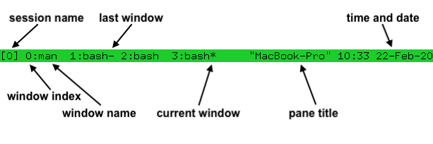

# tmux


# config

1. vim ~/.tmux.conf ，输入以下内容: 
```text
# 开启后鼠标操作将被tmux捕获, 作用是tmux能知道我们的鼠标操作了，副作用是无法拖黑文字
set -g mouse on
# 解决拖黑文字：按如下配置，在窗口里按下 Ctrl + b + m，可临时切换鼠标模式 on / off
bind m set -g mouse \; display "Mouse mode: #{?mouse,on,off}"
# 设置缓冲区大小为 10000 行，这样不至于文件太大超出一个窗口的行数，再往上翻就翻不到了
set-option -g history-limit 10000

```
2. tmux source-file ~/.tmux.conf , 启用配置


# mannual

[https://github.com/tmux/tmux/wiki/Getting-Started](https://github.com/tmux/tmux/wiki/Getting-Started)

或:

`man 1 tmux`

# 操作

`Ctrl + b` + `s` 可视化选择任意session，同时，按下左右键可以对当前session的windows进行展开和收起，以及对某个windows的panes进行展开并选择某一pane。

```bash

# 新建session
$ tmux new -s <session_name>

# detach
ctrl + b，然后按d

# attach
$ tmux attach-session -t <session_name>
$ tmux a -t <session_name>

# list session
$ tmus ls

# 删除会话
# 使用会话编号或具体名字
$ tmux kill-session -t 0
$ tmux kill-session -t <session-name>
```

状态栏:



在某个session里时，

`Ctrl + b` `c`可以创建新的window。

`Ctrl+b` `0` 可以切换到0号window。

`Ctrl + b` `p`切换到上一个window。

`Ctrl + b` `n`切换到下一个window。

`Ctrl+b` `,` 对当前window进行重命名。

`Ctrl+b` `w` 可以从window列表里选择window，该显示结果与`Ctrl + b` + `s` 一样。

在新建的一个window里，默认只有一个pane，但是可以对其进行切分：

`Ctrl+b` `%` 可以将当前pane分成左右两个panes。(常用)

`Ctrl+b` `"` 可以将当前pane分成上下两个panes。

`Ctrl+b` `o`可以移动到下一个pane里。

`Ctrl+b` `;`可以切换到上一个pane里。

`Ctrl + b` `<arrow key>`也可以直接通过上下左右箭头来切换panes。 (常用)

`Ctrl+b` `x`关闭当前所在pane，这种关闭，会在关闭前进行确认。

`Ctrl + b` `z` 可以将当前的pane进行放大/缩小。

`Ctrl + d` 或者 直接输入`exit`：直接关闭当前pane；如果当前window的所有pane均已关闭，则自动关闭当前window；直至所有window均已关闭，则自动关闭当前session。

启用鼠标:

在Ubuntu上使用Tmux是一件非常舒服的事，但有时使用鼠标滚轮时，和平时使用终端的习惯不怎么一致，因此可以设置启用鼠标滚轮。
具体方式：
按完前缀ctrl+B后，再按冒号：进入命令行模式，
输入以下命令：

set -g mouse on

就启用了鼠标滚轮，可以通过鼠标直接选择不同的窗口，也可以上下直接翻页。

Tip
但在以上设置下，会发现无法用中键向 tmux 中复制文本，也无法将 tmux 中选择好的文本中键复制到系统其他应用程序中。
这里有一个 trick，那就是在 tmux 中不论选择还是复制时，都按住 Shift 键，你会发现熟悉的中键又回来了 ? 此外，还可以使用 Shift+Insert 快捷键将系统剪切板中的内容输入 tmux 中。 相对于 tmux 原生的选择模式（不加 shift 键），使用系统选择有个缺陷，即当一行内存在多个面板时，无法选择单个面板中的内容，这时就必须使用 tmux 自带的复制粘贴系统了。


# 常见问题

1. 复制粘贴到vim时格式乱掉
解决方案: 粘贴前启用 Vim 的“粘贴模式”   
在vim中, :set paste, 然后粘贴，再执行, :set nopaste   
  