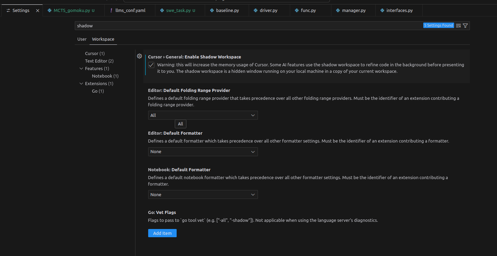

# Shortcuts

Ctrl + L: Open the chat tab

Ctrl + , : Open vscode settings

Ctrl + J: Open/Hide bottom panel

Ctrl + I: Open chat with Composer

Ctrl + Shift + I: Open Composer page

# Shadow Workspace

open the vscode settings, then check the box

# Future

1. I’m wondering if there is a potential there to let it access DevTools and the browser window in the future. If the AI could also see the Elements, Styles, Network panel and take screenshots of the UI, this would make it very powerful.

2. 