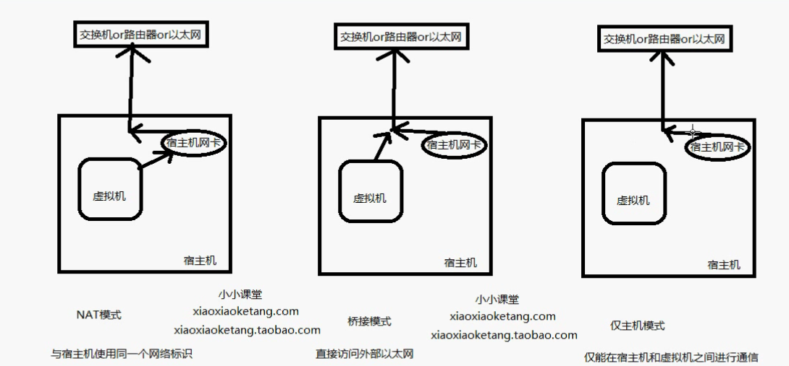

# VMware安装与破解
vmware 安装包: 
见百度网盘vmware workstation 16 full

vmware 破解码:
```shell
VMware Workstation Pro 16.x Serials

YA7RA-F6Y46-H889Z-LZMXZ-WF8UA
ZV7HR-4YX17-M80EP-JDMQG-PF0RF
UC3XK-8DD1J-089NP-MYPXT-QGU80
GV100-84W16-M85JP-WXZ7E-ZP2R6
YF5X2-8MW91-4888Y-DNWGC-W68TF
AY1XK-0NG5P-0855Y-K6ZXG-YK0T4

VMware Workstation Player 16.x Serials

FC3D0-FTFE5-H81WQ-RNWZX-PV894
AU3TA-8VFDP-08DUZ-VMM7X-YK8GF
ZF3XK-22F5K-M88AQ-ZMWQV-QCRGA
FF718-6JDEK-M8DRQ-FNWEX-QG2X4
ZA3DA-43Z9J-089TQ-36N5V-NLHEF
YY19A-6TX94-H88KQ-4NNXG-XAUF6
```


# 三种网络模式



## NAT
Network Address translation
所有的虚拟机构成一个局域网，这个局域网的网关(网络的出口)是宿主机，所以上网时和宿主机用的是同样的网络标识


## Bridge
虚拟机和宿主机不是主从关系，上网使用宿主机通道，有自己的网络标识


## Host-only


# NAT模式设置静态ip

前提: 先关闭虚拟机

## 修改网络模式为NAT

点击虚拟机 -> 右键 -> 设置

修改网络适配器为NAT模式或自定义中的NAT模式


## 创建虚拟网络

打开虚拟网络编辑器，进行虚拟子网创建

点击VMnet8，点击【更改设置】，取消【使用本地DHCP服务器IP地址】前面的勾

再分配IP地址

这里的子网IP最后是 ".0" 结尾，代表分配了一个网段，结合子网掩码进行计算。
子网网段尽量和主机的IP网段不同
记住这个子网IP网段(192.168.80.0)和子网掩码(255.255.255.0)，待会会用到

再点击【NAT设置】

设置网关，这个网关必须在刚才创建的子网下，但不能和待会要设置的虚拟机IP地址相同

然后一路点击确定

## 修改虚拟机中CentOS的网络配置
打开虚拟机CentOS，去修改网络配置文件:
```shell
cd /etc/sysconfig/network-scripts # 进入配置目录
sudo vi ifcfg-eno16777736  # 系统不一样，网卡名称也不一样
```
修改如下字段:
```shell
BOOTPROTO=static
ONBOOT=yes
IPADDR=192.168.80.12  #需要和设置的IP段统一，这里192.168.80.12在192.168.80.0(掩码255.255.255.0)的网段下
NETMASK=255.255.255.0  # 照着刚才设置的填
GATEWAY=192.168.80.2  # 需要和vmware虚拟网卡设置的网关一致，不能和IPADDR相同
DNS1=192.168.100.1  # 通过ipconfig(win10)查看宿主机的DNS，否则会导致能ping通外部IP，不通外部域名
```
注意; 这里的DNS如何查看:
在宿主机(win10上):

因为我现在连的是WIFI，所以查看无线局域网WLAN的配置，可以看到默认网关，那么这就是我们要找的DNS
如果是连接的有线网，应该去找以太网适配器 以太网中的DNS地址

配置文件更改后，重启网络:
```shell
sudo systemctl restart network
```
## 测试
测试下是否大功告成:
用sudo reboot重启，再ifconfig查看是否为设置好的IP地址
ping www.baidu.com，看是否能ping通

# 解决: NAT下Host ping不通Guest
问题描述: Guest能ping Host与Internet主机，Host ping 不通 Guest

更改VMnet8网卡设置
右键网络  ->   点击【打开"网络"和Internet设置】 -> 点击【更改适配器选项】

点击VMnet8，再点击【属性】

点击【Internet协议版本4】 -> 点击【属性】，在弹出窗口里点击【使用下面的IP地址】
填入IP地址与子网掩码:
在设置的虚拟机网段里(我的是192.168.80.0(255.255.255.0))，再新分配一个主机地址(注意不要和Guest的IP一样)，这里我随便分配了个192.168.80.10(255.255.255.0)

## 
一路点击确定即可

运维结果验证:
在Host里Ping Guest的IP试试
