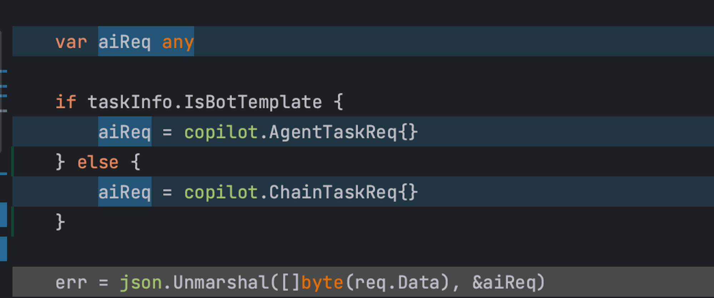

1. Go不支持方法重载(overloading)，它的设计哲学认为方法名相同，但入参列表不同 这样的写法容易造成程序员搞不清楚每个方法具体不同之处，因此建议每个方法名都不相同。即: 显示的 > 隐式的
2. json unmarshal的时候对象类型一定得是确定的子类对象，否则unmarshal后将全是map

<div align='center'>
  
</div>

3. 判断某个interface{}的量（哪怕是数字这种标量）== 0或者一个数字：

不要直接写v == 0，**即便v的值是0，也会判false ，因为go会先判断类型相等与否**

正确操作:

```
import `"code.byted.org/gopkg/lang/conv"`

`conv.Int64Default(v, 0) == 0`
```
