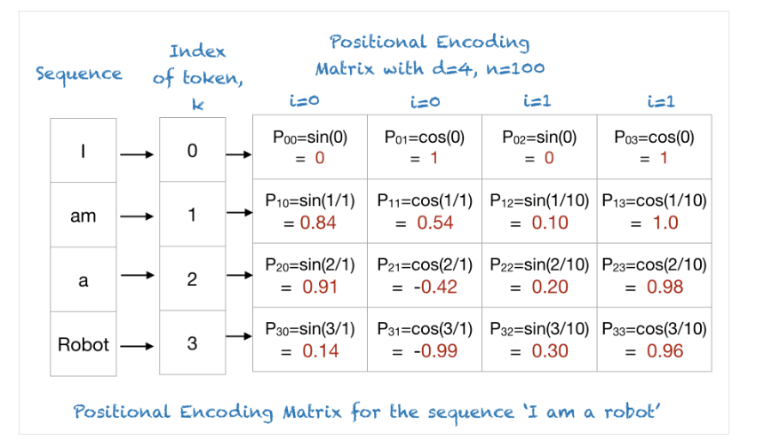
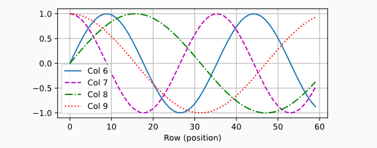
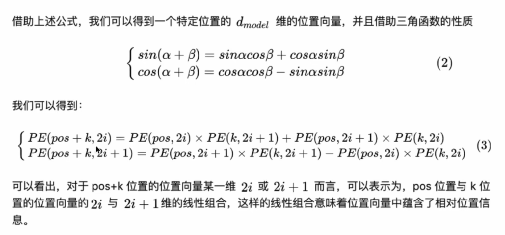

# Positional Encoding

Owner: Jock Nile

位置编码

# transformer里的位置编码

这里以Transformer里的位置编码举例

一个n个token, 每个d维的序列表示为 $X \in \R^{n \times d}$ , 位置编码表示为 $P \in \R^{n \times d}$，输出为$X + P$

矩阵P中，第i行第2j列  第i行第2j+1列的元素分别表示为:

$$
p_{i, 2j} = \sin(\frac{i}{10000^{2j /d}}),\\

p_{i, 2j+1} = \cos(\frac{i}{10000^{2j/d}})
$$

第i行代表token在序列中的位置为第i个token，第j列代表Positional Encoding向量的第j个维度

代码实现:

[https://github.com/NileZhou/ML/blob/main/positional_encoding.py](https://github.com/NileZhou/ML/blob/main/positional_encoding.py)

直观理解:

假设seq_len=4, n=100(原本为10000,为pow的base). d=4(词向量长度)

第0行从左到右: 变化很快，代表这个正弦曲线频率比较高

第3行从左到右: 变化稍慢，代表这个正弦曲线频率比较低

即pos=i的token离第1个token离得越远，第i个位置编码是个更低频的正弦曲线

另一个直观理解:

PE有很多种，transformer选择这种是因为作者看上了它的 “$PE_{pos+k}$ 可以表示为$PE_{pos}$的线性相关函数的形式” 这个特点

