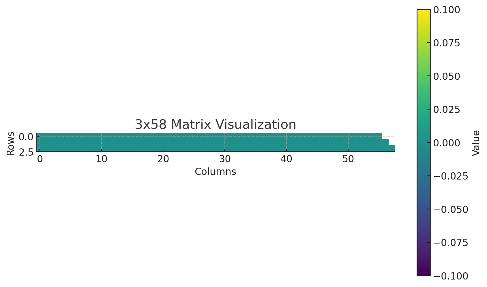

源码阅读: [https://blog.csdn.net/weixin_43508499/article/details/132554559](https://blog.csdn.net/weixin_43508499/article/details/132554559)

1/2/3 总结: [https://zhuanlan.zhihu.com/p/636784644](https://zhuanlan.zhihu.com/p/636784644)

medium上的总结，包含旋转位置编码等: [https://medium.com/@vi.ai_/exploring-and-building-the-llama-3-architecture-a-deep-dive-into-components-coding-and-43d4097cfbbb](https://medium.com/@vi.ai_/exploring-and-building-the-llama-3-architecture-a-deep-dive-into-components-coding-and-43d4097cfbbb)

zhihu: [https://zhuanlan.zhihu.com/p/636784644](https://zhuanlan.zhihu.com/p/636784644)

# LLaMA2

## 词表

大小: 32k

特殊token: ['`<s>`', '`</s>`', '`<unk>`']

注意 `additional_special_tokens`，似乎是可以对special token进行动态扩展的?


## Chat Template

jinja2语法:




{{ '<|user|>
' + message['content'] + eos_token }}

{{ '<|system|>
' + message['content'] + eos_token }}

{{ '<|assistant|>
'  + message['content'] + eos_token }}


{{ '<|assistant|>' }}




## 模型结构与计算过程

### TinyLlama-1.1B

TinyLlama/TinyLlama-1.1B-Chat-v1.0

参数量: 1,100,048,384

22个Decoder层

```python
LlamaForCausalLM(
  (model): LlamaModel(
    (embed_tokens): Embedding(32000, 2048)
    (layers): ModuleList(
      (0-21): 22 x LlamaDecoderLayer(
        (self_attn): LlamaSdpaAttention(
          (q_proj): Linear(in_features=2048, out_features=2048, bias=False)
          (k_proj): Linear(in_features=2048, out_features=256, bias=False)
          (v_proj): Linear(in_features=2048, out_features=256, bias=False)
          (o_proj): Linear(in_features=2048, out_features=2048, bias=False)
          (rotary_emb): LlamaRotaryEmbedding()
        )
        (mlp): LlamaMLP(
          (gate_proj): Linear(in_features=2048, out_features=5632, bias=False)
          (up_proj): Linear(in_features=2048, out_features=5632, bias=False)
          (down_proj): Linear(in_features=5632, out_features=2048, bias=False)
          (act_fn): SiLU()
        )
        (input_layerSdpaAttnorm): LlamaRMSNorm()
        (post_attention_layernorm): LlamaRMSNorm()
      )
    )
    (norm): LlamaRMSNorm()
  )
  (lm_head): Linear(in_features=2048, out_features=32000, bias=False)
)SdpaAtt
```

**LlamaSDPAttention 计算**

head_dim(64) = hidden_size(2048) // num_heads(32)       代表着kv cache中k, v的最后一维

num_key_value_groups(8) = num_heads(32) // num_key_value_heads(4)

q_proj: in_2048 —> out_2048 全连接     out计算: num_heads(32)  * head_dim(64)

k_proj: in_2048 —> out_256  全连接      out计算: num_key_value_heads(4) * head_dim(64)

v_proj: in_2048 —> out_256  全连接      out计算: num_key_value_heads(4) * head_dim(64)

query_states (1, 1, 2048) —> (1, 32, 1, 64) (bsz, num_heads, q_len, head_dim)

key_states (1, 1, 256) —> (1, 4, 1, 64) (bsz, num_key_value_heads, q_len, head_dim)

—> 加上此序列之前(假设有15个token)的key_states (1, 4, 16, 64)

—> repeat num_key_value_groups次   (1, 32, 16, 64)

value_states (1, 1, 256) —> (1, 4, 1, 64) (bsz, num_key_value_heads, q_len, head_dim)

—> 加上此序列之前(假设有15个token)的key_states (1, 4, 16, 64)

—> repeat num_key_value_groups次   (1, 32, 16, 64)

计算attention的时候:

query (1, 32, 1, 64)

key (1, 32, 16, 64)

value (1, 32, 16, 64)

causal_mask(1, 1, 1, 16): 全是0

attention输出: (1, 32, 1, 64) → 转化shape 为 (1, 1, 2048)

### Llama2-7B

词向量长度: 2048

参数量: 6,738,415,616

32个Decoder层

```python
LlamaModel(
  (embed_tokens): Embedding(32000, 4096)
  (layers): ModuleList(
    (0-31): 32 x LlamaDecoderLayer(
      (self_attn): LlamaSdpaAttention(
        (q_proj): Linear(in_features=4096, out_features=4096, bias=False)
        (k_proj): Linear(in_features=4096, out_features=4096, bias=False)
        (v_proj): Linear(in_features=4096, out_features=4096, bias=False)
        (o_proj): Linear(in_features=4096, out_features=4096, bias=False)
        (rotary_emb): LlamaRotaryEmbedding()
      )
      (mlp): LlamaMLP(
        (gate_proj): Linear(in_features=4096, out_features=11008, bias=False)
        (up_proj): Linear(in_features=4096, out_features=11008, bias=False)
        (down_proj): Linear(in_features=11008, out_features=4096, bias=False)
        (act_fn): SiLU()
      )
      (input_layernorm): LlamaRMSNorm()
      (post_attention_layernorm): LlamaRMSNorm()
    )
  )
  (norm): LlamaRMSNorm()
)
```

past_key_values: (32, 2, b, num_head, seq_len, hidden_dim)

```json
LlamaConfig {
  "_name_or_path": "/home/xiaoyi/.cache/huggingface/hub/models--TinyLlama--TinyLlama-1.1B-Chat-v1.0/snapshots/de253fa9783f8bd558c9ed398c8ffbe3c55cedb3",
  "architectures": [
    "LlamaForCausalLM"
  ],
  "attention_bias": false,
  "attention_dropout": 0.0,
  "bos_token_id": 1,
  "eos_token_id": 2,
  "hidden_act": "silu",
  "hidden_size": 2048,  // 输入层词向量长度
  "initializer_range": 0.02,
  "intermediate_size": 5632,
  "max_position_embeddings": 2048,
  "model_type": "llama",
  "num_attention_heads": 32,
  "num_hidden_layers": 22,
  "num_key_value_heads": 4,
  "pretraining_tp": 1,
  "rms_norm_eps": 1e-05,
  "rope_scaling": null,
  "rope_theta": 10000.0,
  "tie_word_embeddings": false,
  "torch_dtype": "bfloat16",
  "transformers_version": "4.39.3",
  "use_cache": true,
  "vocab_size": 32000
}
```

### Llama2-13B

参数量: 13,015,864,320

40个Decoder层

```python
LlamaForCausalLM(
  (model): LlamaModel(
    (embed_tokens): Embedding(32000, 5120)
    (layers): ModuleList(
      (0-39): 40 x LlamaDecoderLayer(
        (self_attn): LlamaSdpaAttention(
          (q_proj): Linear(in_features=5120, out_features=5120, bias=False)
          (k_proj): Linear(in_features=5120, out_features=5120, bias=False)
          (v_proj): Linear(in_features=5120, out_features=5120, bias=False)
          (o_proj): Linear(in_features=5120, out_features=5120, bias=False)
          (rotary_emb): LlamaRotaryEmbedding()
        )
        (mlp): LlamaMLP(
          (gate_proj): Linear(in_features=5120, out_features=13824, bias=False)
          (up_proj): Linear(in_features=5120, out_features=13824, bias=False)
          (down_proj): Linear(in_features=13824, out_features=5120, bias=False)
          (act_fn): SiLU()
        )
        (input_layernorm): LlamaRMSNorm()
        (post_attention_layernorm): LlamaRMSNorm()
      )
    )
    (norm): LlamaRMSNorm()
  )
  (lm_head): Linear(in_features=5120, out_features=32000, bias=False)
)SdpaAtt
```

config:

```json
LlamaConfig {
  "_name_or_path": "meta-llama/Llama-2-13b-chat-hf",
  "architectures": [
    "LlamaForCausalLM"
  ],
  "attention_bias": false,
  "attention_dropout": 0.0,
  "bos_token_id": 1,
  "eos_token_id": 2,
  "hidden_act": "silu",
  "hidden_size": 5120,
  "initializer_range": 0.02,
  "intermediate_size": 13824,
  "max_position_embeddings": 4096,
  "model_type": "llama",
  "num_attention_heads": 40,
  "num_hidden_layers": 40,
  "num_key_value_heads": 40,
  "pretraining_tp": 1,
  "rms_norm_eps": 1e-05,
  "rope_scaling": null,
  "rope_theta": 10000.0,
  "tie_word_embeddings": false,
  "torch_dtype": "bfloat16",
  "transformers_version": "4.39.3",
  "use_cache": true,
  "vocab_size": 32000
}

```

**LlamaSDPAttention 计算**

输入 (当前last_input_ids长度为3, prefix总长度为58):

- hidden_states (b, seq_len_of_input, n_in_features) (1, 3, 5120)
- attention_mask (b, , seq_len_of_input, n_in_feat) (1, 1, 3, 58)
- position_ids (1, 3)
- past_key_value 40层，每层分为past_key和past_value，都为(1, 40, 55, 128)   (b, num_key_value_heads, )
  - 55: 一开始输入模型的input_ids长度
  - 128: hidden_size(5120) // num_key_value_heads(40)

计算

1. 初始化q, k, v, o的proj (全连接矩阵)

```python
# 从这可以看出，q_proj和o_proj的输出维度和输入维度相同
# k_proj和v_proj的输出维度要看num_key_value_heads多大
q_proj = nn.Linear(hidden_size, num_heads * head_dim, bias=config.attention_bias)
k_proj = nn.Linear(hidden_size, num_key_value_heads * head_dim, bias=config.attention_bias)
v_proj = nn.Linear(hidden_size, num_key_value_heads * head_dim, bias=config.attention_bias)
o_proj = nn.Linear(hidden_size, hidden_size, bias=config.attention_bias)
```

hidden_size = `config.hidden_size` : 5120

num_heads = `config.num_attention_heads`  : 40

num_key_value_heads = `config.num_key_value_heads` : 40

head_dim = `hidden_size // num_heads` : 5120 // 40 == 128

可推出 (同输出model里的)

q_proj, k_proj, v_proj, o_proj : (5120, 5120)

1. q,k,v的proj (全连接计算，可以看到因为有kv cache的存在，这里第二维都是3，没有计算全部的全连接)

```python
query_states = self.q_proj(hidden_states)
key_states = self.k_proj(hidden_states)
value_states = self.v_proj(hidden_states)
```

结果都为(1, 3, 5120)

1. reshape

query_states: (bsz, num_heads, q_len, head_dim) (1, 40, 3, 128)

key_states: (bsz, num_kv_heads, q_len, head_dim) (1, 40, 3, 128)

value_states: (bsz, num_kv_heads, q_len, head_dim) (1, 40, 3, 128)

1. 旋转位置编码

```python
self.rotary_emb = LlamaRotaryEmbedding(
    self.head_dim, # 128
    max_position_embeddings=self.max_position_embeddings, # 4096 同config.max_position_embeddings
    base=self.rope_theta, # 10000 同 config.rope_theta
)
```

```python
# 获得与value对应的 旋转位置编码 (注意，这里value_states不会变)
# position_ids(1, 3): [[55, 56, 57]] 代表这3个token的位置
# cos, sin的shape都为(1, 3, 128) 同 (bsz, q_len, head_dim)
cos, sin = self.rotary_emb(value_states, position_ids)

# 将旋转位置编码用于query_states和key_states
# q, k 都经历了以下步骤
# q_embed = (q * cos) + (rotate_half(q) * sin)  # 这里的转一半是指最后一维逆时针转90度
query_states, key_states = apply_rotary_pos_emb(query_states, key_states, cos, sin)
```

1. 获取past_key_value，填充key_states和value_states为全的状态

40层，每层都为(1, 40, 55, 128)

```python
# 填充之前的key_states: (1, 40, 3, 128)
# 填充之后的key_states: (1, 40, 58, 128)
key_states, value_states = past_key_value.update(key_states, value_states, self.layer_idx, cache_kwargs)
```

继续将key和value states填充全:

num_key_value_groups = `num_heads // num_key_value_heads`  = 40 / 40 == 1

代表着: 一个注意力头可能有多个key_value头，它们为一组，在最后计算scal_dot_product_attention的时候会repeat，变为num_heads个

```python
# 将(1, 40, 58, 128) 扩为 (1, 40*num_key_value_groups, 58, 128)
key_states = repeat_kv(key_states, num_key_value_groups)
value_states = repeat_kv(value_states, num_key_value_groups)
```

1. 计算attention_mask

这里是attention_mask的一种即causal_mask，即每个token只能看到当前位置及其之前位置的信息

(1, 1, 3, 58) —> (1, 1, 3, 58)

```python
causal_mask = attention_mask
# if attention_mask is not None and cache_position is not None:
if attention_mask is not None:
    # 保证最后一维的大小和key/value_states的seq_len对的上
    causal_mask = causal_mask[:, :, :, : key_states.shape[-2]]

```

1. 使得q,k,v在内存空间里连续
2. 进行QKV公式计算: scaled_dot_product_attention，得到attn_output (1, 40, 3, 128)

   输入query_states: (1, 40, 3, 128) (bsz, num_heads, query_len, head_dim)

   key_states: (1, 40, 58, 128) (bsz, num_heads, prefix+query_len, head_dim)

   causal_mask: (1, 1, 3, 58) (bsz, 1, query_len, prefix+query_len)

一个3 * 58的矩阵，第一行最后2个数是-inf，第二行最后1个数是-inf，其它数全为0

**行号代表当前要推理的token，列号中为0的代表这个token可以看到的部分**。



1. o_proj，对attn_output先reshape再进行一层全连接proj计算

最终attn_output (1, 3, 5120)

返回past_key_value（这一层对应的key_states和value_states已经变成(1, 40, 58, 128)了，即

 (bsz, num_heads, prefix+query_len, head_dim)）

后续还没计算的层的past_key_value还是 (1, 40, 55, 128)
