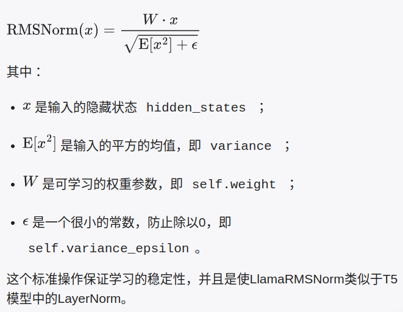
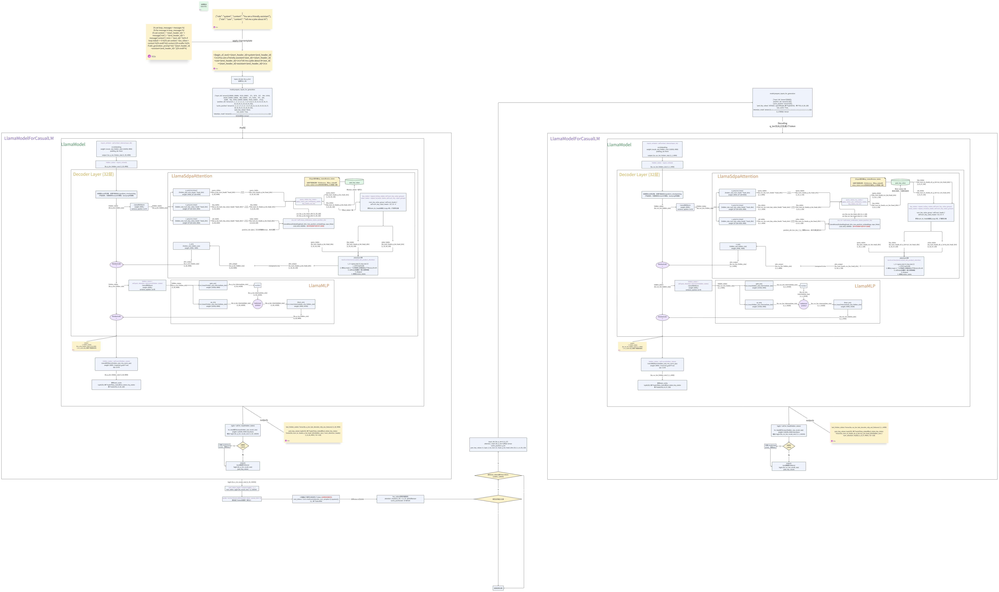

## Chat Template

```python
<|begin_of_text|>

<|start_header_id|>system<|end_header_id|>{{ system_prompt }}<|eot_id|>

<|start_header_id|>user<|end_header_id|>{{ user_message }}<|eot_id|>

<|start_header_id|>assistant<|end_header_id|>
```

注意这里的回车换行是为了读这篇笔记的人方便理解，实际实现代码时没有换行

参考: [https://llama.meta.com/docs/model-cards-and-prompt-formats/meta-llama-3/](https://llama.meta.com/docs/model-cards-and-prompt-formats/meta-llama-3/)

jinja2语法:








{{ content }}



{{ '<|start_header_id|>assistant<|end_header_id|>' }}



## 模型结构与计算过程

### LLaMA3-8B-Instruct

可以看到一些重要参数:

- vocab_size: 128,256
- n_layers: 32

```bash
LlamaForCausalLM(
  (model): LlamaModel(
    (embed_tokens): Embedding(128256, 4096)
    (layers): ModuleList(
      (0-31): 32 x LlamaDecoderLayer(
        (self_attn): LlamaSdpaAttention(
          (q_proj): Linear(in_features=4096, out_features=4096, bias=False)
          (k_proj): Linear(in_features=4096, out_features=1024, bias=False)
          (v_proj): Linear(in_features=4096, out_features=1024, bias=False)
          (o_proj): Linear(in_features=4096, out_features=4096, bias=False)
          (rotary_emb): LlamaRotaryEmbedding()
        )
        (mlp): LlamaMLP(
          (gate_proj): Linear(in_features=4096, out_features=14336, bias=False)
          (up_proj): Linear(in_features=4096, out_features=14336, bias=False)
          (down_proj): Linear(in_features=14336, out_features=4096, bias=False)
          (act_fn): SiLU()
        )
        (input_layernorm): LlamaRMSNorm()
        (post_attention_layernorm): LlamaRMSNorm()
      )
    )
    (norm): LlamaRMSNorm()
  )
  (lm_head): Linear(in_features=4096, out_features=128256, bias=False)
)

```

1. nn.Embedding
2. causual mask更新
3. for decoder layer in decoder layer:
   1. rmsnorm (本decoder layer的)
   2. self attention
      1. 对hiddenstates做q, k, v projection(full-connect)
      2. 输入position_ids, value_states，计算rotary_emb，得到cos, sin
      3. query_states, key_states上apply cos和sin
      4. `key_states, value_states = past_key_value.update(key_states, value_states, self.layer_idx, cache_kwargs)`    更新及使用kv cache
      5. Group Query Attention：`repeat_kv` kv组数
      6. `scaled_dot_product_attention`:  输出shape为(b, …, query_len, val_dim)
      7. 对attn_output进行o_proj
   3. residual (X’ = X + F(X))
   4. post rmsnorm (本decoder layer的另一个)
   5. mlp
   6. residual
4. norm一下 (llama model的)
5. lm_head (LLaMAForCausualLM的， 全连接层，转成logits  最后vocabsize的)
6. copy_head (输入: 1. 4步norm的输出 2. 第一个decoder layer层的query_states， key_states (应用了位置编码后))  (输出: <b, prefix_query_seq_len> —> ()  还可以看lm_head输出采样后能不能和copy&paste 对得上)

- 第一次输出token, shape为(b, prefix_len, vocab_size)
- 后面n次输出shape为 (b, 1, vocab_size)

========

1. 采样，从logits到token   (greed就是np.argmax(`next_tokens_scores`, dim=-1))  这里可以很复杂，是一个processor list

贯穿所有tensor的shape计算:

1. 只有第一次forward，seq_len为prefix_len
2. 之后n次，seq_len都为1，只有在sdpa_attention计算时, k v cache起作用，会让Key_states和val_states变为all_len

## LayerNormalization

尽管规范化带来了训练稳定性的提升，但同时也可能消除或减弱了某些对模型训练有益的特征信号。可学习参数可以在一定程度上恢复这些可能丢失的信息，避免对模型性能有不利影响。



$$
\text{RMSNorm(x)} = \frac{W \cdot x}{\sqrt{E[x^2] + \epsilon}}
$$

```bash
hidden_states:
[[[1, 2, 3],
  [4, 5, 6]]]
  
hidden_states.pow(2):
[[[ 1.,  4.,  9.],
  [16., 25., 36.]]]
  
hidden_states.pow(2).mean(-1):
[[ 4.6667, 25.6667]]

```

rsqrt (`*reciprocal` ,倒数*): 求平方根的倒数，torch底层肯定使用了**平方根倒数速算法：** [https://zh.wikipedia.org/wiki/平方根倒数速算法](https://zh.wikipedia.org/wiki/%E5%B9%B3%E6%96%B9%E6%A0%B9%E5%80%92%E6%95%B0%E9%80%9F%E7%AE%97%E6%B3%95)

$\text{out}_{i} = \frac{1}{\sqrt{\text{input}_{i}}}$

## LlamaRotaryEmbedding

计算逆频率 `inv_freq`:

$$
\text{inv\_freq}[i] = \frac{1}{\text{base}^{\frac{2i}{\text{dim}}}}
$$

计算缓存频率和emb:

$$
t = \frac{\text{torch.arange}(\text{max\_seq\_len\_cached})}{\text{scaling\_factor}}\text{freqs}[i, j] \\ = t[i] \times \text{inv\_freq}[j]\text{emb} \\ = \text{torch.cat}(\text{freqs}, \text{freqs}, \text{dim}=-1)
$$

## LlamaSdpaAttention

[https://github.com/meta-llama/llama-recipes](https://github.com/meta-llama/llama-recipes)

llama相关操作：

https://github.com/meta-llama/llama-recipes

# Decoder architecture

因果(causual)解码器


行代表当前计算的目标token，列代表可关联信息的token

# Total Architecture


编辑: [feishu](https://aimqq0022gd.feishu.cn/wiki/YZ0mwL7Oyi0295kawpfchbrcnqd?wiki_all_space_view_source=space_sidebar&fromScene=spaceOverview)


