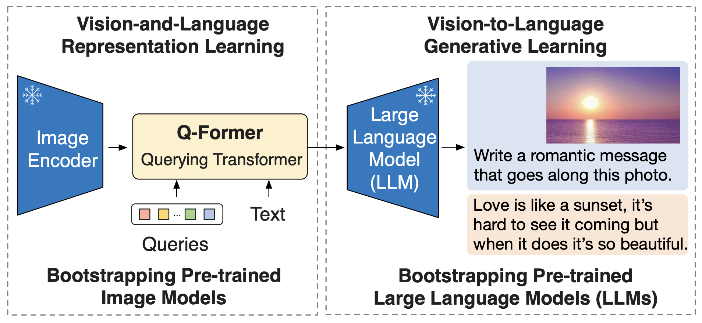
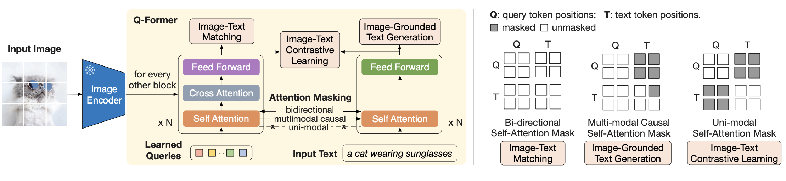

# BLIP
提出时间: 2022年1月
一作: Junnan Li
提出机构: Salesforce Research
BLIP: Bootstrapping Language-Image Pre-training for Unified Vision-Language Understanding and Generation

# BLIP-2
提出时间: 2023年1月
一作: Junnan Li
提出机构: Salesforce Research
BLIP-2: Bootstrapping Language-Image Pre-training with Frozen Image Encoders and Large Language Models
提出了Q-Former

其中Image Encoder和LLM都是参数冻结的

Overview:

## Q-Former
lightweight Query Transformer, which is pretrained in 2 stages:
1. vision-language representation learning from a frozen image encoder
2. vision-to-language generative learning from a frozen LLM

Overview of Q-Former:

Q-Former 初始化为BERT_{base}，参数量为188M，包含Learned Queries

# Qwen2-VL

## Architecture Innovation

### Dynamic Resolution
Qwen2-VL can handle arbitrary image resolutions, mapping them into a dynamic number of visual tokens, offering a more human-like visual processing experience.

### Multimodal Rotary Position Embedding (M-ROPE)
Decomposes positional embedding into parts to capture 1D textual, 2D visual, and 3D video positional information, enhancing its multimodal processing capabilities.

