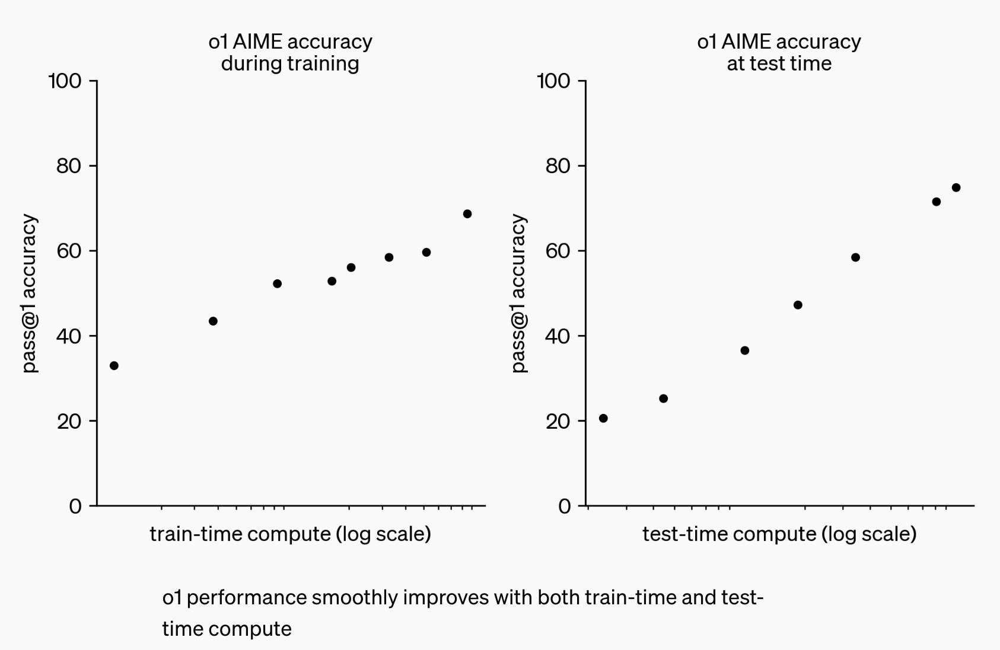

# o1

>  Through reinforcement learning, o1 learns to hone its chain of thought and refine the strategies it uses. It learns to recognize and correct its mistakes. It learns to break down tricky steps into simpler ones. It learns to try a different approach when the current one isn’t working.

key points:
- using RL model to judge, then let model to correct itself
- learn to break down tricky steps into simpler ones
- learn to try a different approach when the current one isn’t working

