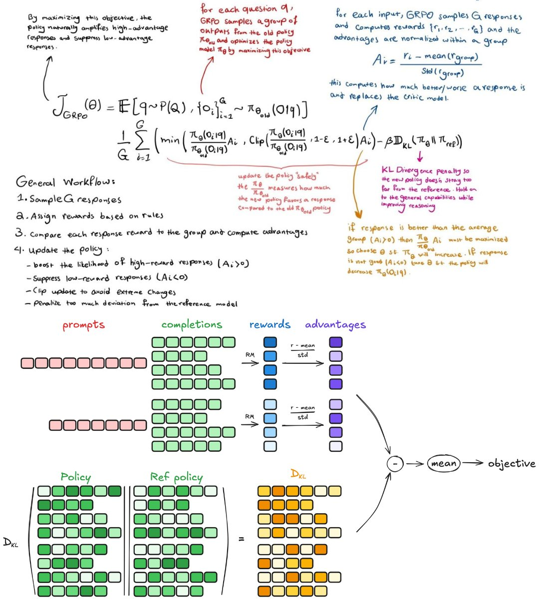
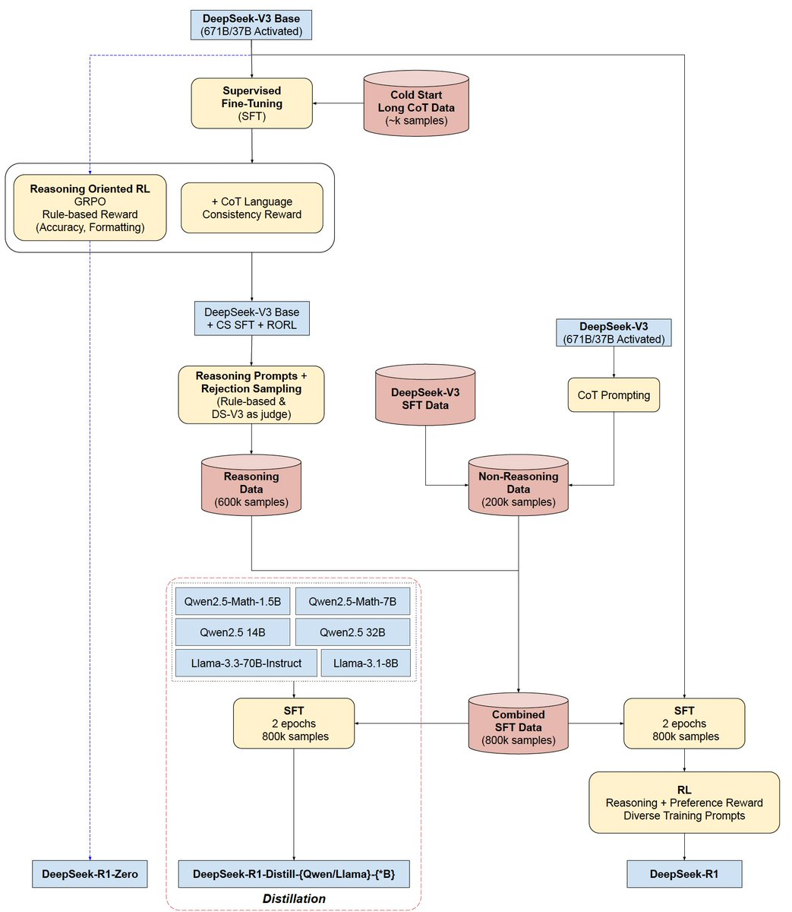
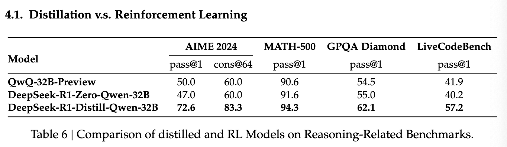

[TOC]


# DeepSeek-R1-Zero

无finetune数据，纯RL训练，得到约为o1-mini性能的模型

没使用通常与policy model大小一致的critic model，采用GRPO (Group Relative Policy Optimization)算法，GRPO 不依赖 critic模型，可简化训练。


## GRPO算法




GRPO算法详解：对于一个问题q，用老policy模型 $\pi_{\theta_{old}}$生成一组输出 $\{o_1, o_2, \cdots, o_G\}$ ，然后通过更新policy model $ \pi_{\theta} $ 的参数使以下objective函数最大化来优化policy model:
$$
\mathcal{J}_{GRPO}(\theta)=\mathbb{E} [ q \sim P(Q), \{o_i\}_{i=1}^G \sim \pi_{\theta_{old}}(O|q)] \frac{1}{G} \sum_{i=1}^G \left[ \min \left(\frac{\pi_\theta(o_i|q)}{\pi_{\theta_{\text{old}}}(o_i|q)} A_i, \text{clip}\left(\frac{\pi_\theta(o_i|q)}{\pi_{\theta_{\text{old}}}(o_i|q)}, 1 - \epsilon, 1 + \epsilon\right) A_i\right) - \beta \mathbb{D}_{\text{KL}}(\pi_\theta \| \pi_{\text{ref}})\right],
$$
其中
$$
\mathbb{D}_{\text{KL}}(\pi_\theta \| \pi_{\text{ref}}) = \frac{\pi_{\text{ref}}(o_i|q)}{\pi_\theta(o_i|q)} - \log \frac{\pi_{\text{ref}}(o_i|q)}{\pi_\theta(o_i|q)} - 1
$$
这里面的 $\epsilon$ 和 $\beta$ 是超参数， $A_i$ 是 $o_i$在这组里相对其它的优势(advantage)的量化:
$$
A_i = \frac{r_i - \text{mean}(\{r_1, r_2, \cdots, r_G\})}{\text{std}(\{r_1, r_2, \cdots, r_G\})}
$$
可以看到其实就是$r_i$进行了归一化，将reward与group内的baseline进行对比，计算的是**相对于组内均值的改进/劣化而非个体的奖励值大小**

这个公式里，$\frac{\pi_\theta(o_i|q)}{\pi_{\theta_{\text{old}}}(o_i|q)}$ 表示新policy与旧的policy对比，对输出$o_i$概率的比值。这**衡量了policy更新的幅度**

$\text{clip}(x, 1-\epsilon, 1+\epsilon)$ 那一项，指的是对更新幅度进行限制，避免新policy model的输出概率相对老policy model偏差过大。这是借鉴了 PPO（Proximal Policy Optimization）的思想，慢慢调整。


KL散度是一个惩罚项，控制新策略$\pi_\theta$不要偏离参考策略 $\pi_{\theta_{ref}}$太多，避免输出分布发生剧烈变化（类似正则化）

**？？ 但是这里的参考策略 $\pi_{\text{ref}}(o_i|q)$ 是从哪来的呢 ？？**

想明白了，其实就是这一轮更新前的$\pi_{\theta}$


可以看出这个GRPO算法减少个体输出的随机性影响，专注于整体的改进，通过裁剪策略比值（公式 1 中的 $\text{clip}$）和 KL 散度惩罚（公式 2），保证更新过程稳定。


## prompt template

DeepSeek-R1-Zero中给policy model的prompt template

```text
A conversation between User and Assistant. The user asks a question, and the Assistant solves it. The assistant first thinks about the reasoning process in the mind and then provides the user with the answer. The reasoning process and answer are enclosed within <think> </think> and <answer> </answer> tags, respectively, i.e., <think> reasoning process here </think> <answer> answer here </answer>. User: prompt. Assistant:
```


## reward


两种reward:

- accuracy: 
  - 对于有标准答案的数学问题，先让模型输出格式固定，再用基于规则的方法验证
  - 对于代码问题，使用compiler执行代码，再从预定义的test case中拿反馈
- fomat following: 强迫模型将思考过程输出在\<think\>和\</think\>之间


作者没有采用通常与policy model等大小的reward model，是因为作者觉得神经网络模型容易被reward hacking，而且训练reward model把training pipeline搞复杂了


## evaluation

能力大概达到o1-mini，通过简单的major voting也能继续提高百分之十几的性能

**涌现**出了一些反思能力和新的思维策略

aha moment


不足之处在于可读性不好（如多种语言混杂或缺少markdown格式的答案）


# DeepSeek-R1


## 整体pipeline




在zero基础上，通过在前期冷启动阶段用小型高质量CoT数据来解决两个问题：

1. 是否可以提高模型天花板或加速训练收敛速度
2. 是否可以增加模型通用能力，使得更加易用


作者收集了几千条冷启动阶段的高质量数据，输出格式定为：

```text
|special_token|<reasoning_process>|special_token|<summary>
```

<reasoning_process>就是本轮思考过程，\<summary\>就是本轮思考过程的总结

使用这几千条数据，fine-tuning了DeepSeek-V3-Base之后，作者应用了和DeepSeek-R1-Zero一样的大规模RL训练。


## step1 -- SFT  (推理--冷启动)

cold start:

从DeepSeek-V3-Base开始，使用几千条高质量数据进行finetune，主要解决Readability的问题，或许还有高级思维、策略教学(通过kimi-k1.5猜想）
主要是推理的冷启动


## step2 -- RL （主要阶段 推理增强再增强）

主要是在推理、coding、数学、科学等有clear答案的问题上训练。但还是出现了CoT里多种语言混杂的问题，作者设计了新的reward(language consistency reward)，计算方式为CoT的输出token里，目标语言token的占比。

PS: 作者发现引入language consistency reward会轻微降低模型性能，这也算是一种alignment tax了，不过作者认为值得


最终reward = 推理数据集上的 accuracy reward + language consistency reward


## step3 -- SFT  (通用生成任务)

RL训练收敛后，得到一个自闭症推理/代码天才模型，有自己的思维，但是普通人难以读懂。使用其checkpoint，进行SFT阶段训练。


经过强化学习

思想：先提升模型在特定任务（推理）的能力，然后再扩展其通用能力（写作、翻译、角色扮演等）


造两类数据：

1. 推理数据，600k条  

   之前的RL阶段的推理数据集都是通过rule-base的方式验证的，这个阶段用prompt让之前得到的 RL 模型多次输出，DeepSeek-V3来打分，过滤掉不正确的输出**（rejection sampling）**，得到约600k条数据

2. 非推理数据，200k条

   复用了一部分DeepSeek V3的SFT数据集。对于确定不是推理的任务，让DeepSeek-V3在回答前生成CoT(对于太简单的prompt，不让deepseek-v3生成CoT)


**最终训练**：用造出来的 80 万样本进行微调了2个epoch


## step4 -- RL(alignment)

为了提升模型的helpfulness和harmlessness，还有精炼reasoning的能力

- 对于推理数据

  使用rule-based reward在数学，代码，逻辑推理领域训练

- 通用领域

  使用偏好对数据，对齐人类偏好。

  - helpfulness: 关注于回答的final summary确保是否抓住了重点且与用户问题相关，降低推理过程的干扰
  - harmlessness: 整个推理过程和summary是否包含潜在风险、偏见、有毒内容


# Distill


使用阶段2的800k数据，finetune几个dense小模型(主要用了Qwen, LLaMA系列):

DeepSeek-R1-Distill-Qwen-1.5B 在数学benchmark上竟然超过了GPT-4o and Claude-3.5-Sonnet。。。。。


## Distill vs RL



作者想知道：从头RL和直接向强模型DIstll，哪个收益高？

结论如表：还是蒸馏香啊。。计算量小，效果好


当然了，作者也表示，要突破天花板，还是得靠自身RL self-evolve


# 不成功的尝试（重要）


## PRM


作者认为PRM缺点有三：

1. 难以精细且清晰地定义推理步骤中的各个步骤，造过程CoT数据难
2. 判定中间步骤对还是错很难，需要大量标注努力
3. PRM容易被reward hacking


## MCTS


挑战:

1. token生成的搜索空间太大
2. 限制每个节点的最大可扩展数，又会导致模型困在局部最优里
3. value model直接影响了全局，因为它担负着指导每个step前进的重任。而这样的value model很难训练出来

AlphaGo的成功核心在于训好了一个value model来逐渐地增强其性能

