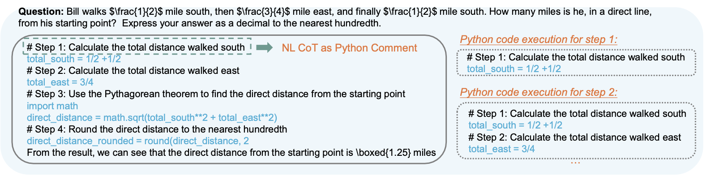
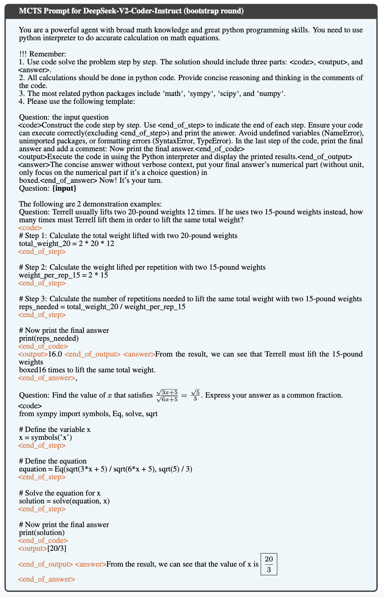

[TOC]

# Background

- paper

​        本论文为: [rStar-Math: Small LLMs Can Master Math Reasoning with Self-Evolved Deep Thinking](https://arxiv.org/abs/2501.04519) 20250108，MSRA实习生做出来的，7B模型推理能力在Benchmark上比肩O1-mini

​        *PS:  [Scaling LLM Test-Time Compute Optimally can be More Effective than Scaling Model Parameters](https://arxiv.org/abs/2408.03314) 2024-08-06 UC Berkeley + Google Deepmind出品，一般认为是test-time compute scaling的开山之作，提出类似System 2式的深度思考范式*

- problem background

  OpenAI 2023年的论文显示出PRM在test-time compute scaling中能提升模型性能，然而用来训练PRM的数据很稀缺，每个步骤都得有人类标注正确/错误。

  目前的主流数据合成方法为从GPT4那蒸馏一些CoT数据来训练policy model，跳过PRM的训练（如20240505的[MathScale: Scaling Instruction Tuning for Mathematical Reasoning](https://arxiv.org/abs/2403.02884)）。然而蒸馏CoT的方法会出现收益逐步降低(diminishing returns)且永远无法超过teacher model的问题。

- task insight

  math reasoning这个任务有特殊性: 光有正确答案不够，还必须保证整个reasoning trace都是对的。 *（在20230717的论文 [Measuring Faithfulness in Chain-of-Thought Reasoning](https://arxiv.org/pdf/2307.13702)里，就得出了结论，有时LLM生成答案依赖CoT，有时会忽略CoT，也就是说答案正确不代表CoT正确）*

- 创新点

  - 基于MCTS的data sythesis

  - 无需step-level score annotation的PRM训练方法(*PS: 文中也把PRM叫PPM(Process Preference Model)*)

  - self-evolution，从头构建两个模型而非蒸馏o1，PRM指导test-time search，policy model进行输出。

- evaluation

​	在百万级合成数据上进行4轮self-evolution训练后，在rStar-Math将Qwen2.5-Math-7B 从58.8%提升到90.0%，Phi3-mini-3.8B从41.4%提升到86.4%

- code

  - non-official 实现: https://github.com/ai-in-pm/rStar-Math?tab=readme-ov-file

  - official: https://github.com/microsoft/rStar (尚未开源)

# Method

- System 2 Reasoning流程：

  - MCTS (**作者选择**)

    - Monte Carlo的思想为通过大量随机**simulate/rollout**出step，Tree Search即在这些step上进行travel的同时，根据verifier提供的step结果进行**selection**、**expansion**、**backpropagation**操作。

    - MCTS的挑战:

      - 计算每一步的Q-Value都需要很多次MCTS rollout，如果次数不足，可能高估或低估某个step的价值
      - 每次 Rollout 涉及多步模拟，每一步可能需要调用复杂的模型（如 GPT-4）来生成结果，计算成本高昂

    - 解决MCTS挑战的方案

      code-augmented CoT 合成方法，4轮迭代，每轮迭代都得到更强的policy SLM和reward model

  - Best-of-N

    N次生成取最优

    *斯坦福+Google在20240731的[Large Language Monkeys: Scaling Inference Compute with Repeated Sampling](https://arxiv.org/abs/2407.21787) 中提出，仅通过重复多次sampling，可在SWEBench-lite上(只取解决方案为改1个python文件就能搞定的case)从15.9%涨到56%*

  - self-consistency

    20220521由Google Brain Team提出，decoding阶段不采用greedy策略，而是生成多个path，然后这些path间进行major voting后收敛为一条reasoning path

    [Self-Consistency Improves Chain of Thought Reasoning in Language Models](https://arxiv.org/abs/2203.11171)

- 使用code-augmented方法来合成CoT数据

​	传统方法存在答案正确但是CoT错误的问题，很难detect和eliminate。作者的方法是每一个step都生成NL(comment) + code，只有成功执行python code，才会被保留下来作为valid的candidate step	

​	bootstrap round的prompt:

​	使用这个prompt，在step i 让policy model生成n个candidates输出，校验输出valid的candidate将会调用python interpreter进行执行。

​	执行成功的候选输出将会被保留下来，然后让PPM进行打分，赋值一个Q-value: $q(s_i)$，然后使用Upper Confidence bounds for Trees (UCT) 来从n个candidates中选择最优的节点作为下一个step。
$$
UCT(s) = Q(s) + c\sqrt{\frac{\ln N_{parent}(s)}{N(s)}}, \quad \text{where}\quad Q(s)=\frac{q(s)}{N(s)}
$$
​	$N(s)$: 所有candidate plan steps中，访问过节点s的数量

​	$N_{parent}(s)$: 访问过节点s的父节点的数量

​	$q(s)$: PPM提供的对节点s的reward，在backpropagation阶段将会更新它

​	c: 一个constant量，用来平衡exploitation和exploration

​	这个式子里的关键是$Q(s)$，

PS: 强化学习概念

- Q-Value

$$
Q(s, a) = 预期总回报 | 从状态s执行动作a的情况下
$$

在MCTS中，Q-value是用来评估从某个状态节点选择某个动作分支后，可能的累计收益

Q-value是通过rollout的结果统计得出的，MCTS 通过多次 Rollout 的结果更新树中节点的 Q-value，从而逐步改进策略。

code-augmented CoT合成方法：

