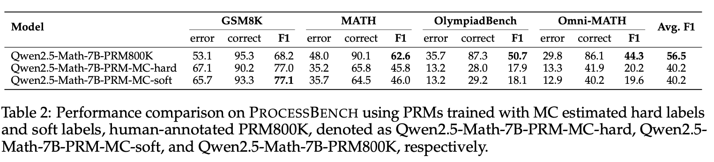
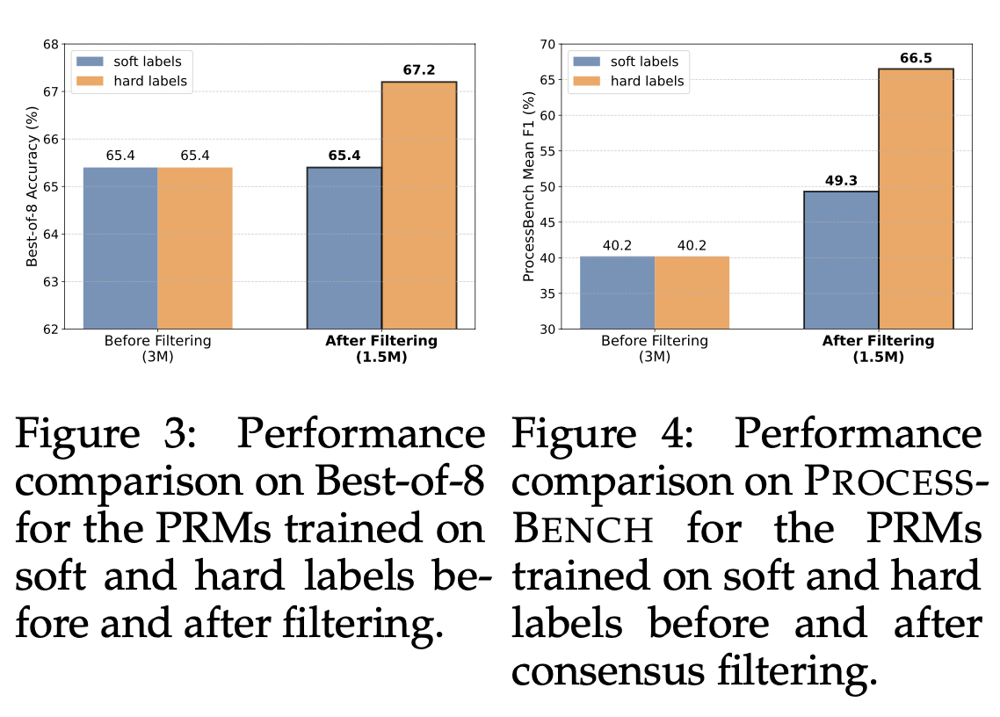

[TOC]


# Background

论文名: [The Lessons of Developing Process Reward Models in Mathematical Reasoning](https://arxiv.org/abs/2501.07301)

2025-01-13


Qwen团队出品

对应模型:

- [Qwen2.5-Math-PRM-7B](https://huggingface.co/Qwen/Qwen2.5-Math-PRM-7B)
- [Qwen2.5-Math-PRM-72B](https://huggingface.co/Qwen/Qwen2.5-Math-PRM-72B)


论文中提及的模型:

- [Qwen2-Math-7B-Instruct](https://huggingface.co/Qwen/Qwen2-Math-7B-Instruct)
- [Qwen2-Math-72B-Instruct](https://huggingface.co/Qwen/Qwen2-Math-72B-Instruct)

- [Qwen2.5-Math-7B-Instruct](https://huggingface.co/Qwen/Qwen2.5-Math-7B-Instruct)
- [Qwen2.5-Math-72B-Instruct](https://huggingface.co/Qwen/Qwen2.5-Math-72B-Instruct)


Best-of-N: OpenAI团队出品，[Let's Verify Step by Step](https://arxiv.org/abs/2305.20050), 2023-05-31, 里面讨论了ORM(Outcome Reward Model)和PRM(Process Reward Model)


# Yield problem


Qwen团队在训练数学推理领域的PRM过程中，发现在训练PRM中广为使用的MC estimation方法存在问题。


- MC estimation方法

  - 原始论文: [Math-Shepherd: Verify and Reinforce LLMs Step-by-step without Human Annotations](https://arxiv.org/abs/2312.08935)  (2023-12-14)

  - 具体实现Github: https://github.com/RLHFlow/RLHF-Reward-Modeling
  - 在The Lessons ... Reasoning论文中具体做法: 
    - 1. 收集近500,000条有golden答案的问题
      2. 对每个问题，通过混合Qwen2-Math-Instruct和Qwen2.5-Math-Instruct 模型的输出，生成6-8个多样性的回答。每个回答都分割了明确的步骤，每个步骤用“\n\n”隔开
      3. 评估每个步骤的正确性：使用Qwen2.5-Math-Instruct系列模型，从当前步骤出发，生成8次，看最后能生成正确答案的概率。
  - The Lessons ... Reasoning论文中模型细节:
    - 从Qwen2.5-Math-7B/72B-Instruct模型中，训练出对应的PRM模型
    - 将原始模型的 LMHead 换成了一个两个线性层组成的头，只输出一个scalar值
    - 使用hard和soft两种label来训练PRM
      - 对于hard label: 从一个step出发，8次补全里任意一次输出标准答案，当前step即为correct，否则为incorrect。在计算每一个step的last token时开始计算，loss使用cross-entropy(CE)。
      - 对于soft label: 计算从当前步骤出发，补全8次能输出正确答案的概率。在计算每一个step的last token时开始计算，loss使用mean squared error(MSE)。
    - 如果某个步骤被标为incorrect，则这个步骤不会纳入后续训练。文中的说法是remove这些错误步骤，可以prevent potential model confusion。（*我个人猜想，应该也有节省算力的考量，正常情况下从8^step降低至8\*(k^step)，k很可能为2*）

- evaluation方法

  两个主要方面：

  1. 能直接提升下游任务performance多少个点
  2. 在推理过程中识别错误step的准确率

  - ProcessBench ：验证PRM本身给step识别正确率能力怎么样

    [ProcessBench: Identifying Process Errors in Mathematical Reasoning](https://arxiv.org/abs/2412.06559)  (2024-12-09)，出QwQ-32B也是这篇论文，数据在[ProcessBench-Dataset](https://huggingface.co/datasets/Qwen/ProcessBench)，共3400条，*也是Qwen团队出的*

    任务为识别出第一步是否为错的，或总结是否所有步骤都是对的。

  - BON (Best-of-N)：验证是否提升下游任务性能，*(下游任务选择GSM8K, MATH, Minerva Math, GaoKao2023 En, PlympiadBench, College Math, MMLU STEM等数学benchmark)*

    - prm@N: 根据PRM，从N个候选中选最高分的为结果。每个候选输出的得分计算公式为：每个独立步骤的得分相乘（和OpenAI团队的Best-of-N计算方式相同）。
    - maj@N: N个候选输出中，主流的答案(majority voting)作为输出结果。
    - pass@N: N个候选输出中，只要有输出达成正确答案即为正确，选择这个能出正确答案的作为结果。

  - Baseline

    - 在PRM800k(OpenAI团队出品的BON论文中带的数据集)上训练得到的PRM


- 初步实验结果：


看最右边的Avg，不管是PRM800K上distll训练，还是MC方法(hard/soft)训练，竟然没有一个能超过maj@8  !  也就是说PRM没什么用


但是看PRM能力的话，在ProcessBench上的实验:



Qwen团队的两个PRM-MC模型都比OpenAI给出的PRM800K数据上直接训练出的PRM要好


所以Qwen团队在反思一个问题：**PRM模型都这么好了，为什么没法提升下游任务性能** ？

他们重点审视：

1. **数据合成方法**：大家普遍用的用于训练PRM的MC estimation数据合成方法是否有问题
2. **evaluation策略**：BoN用作单一的评估指标的bias


# Discussion and Analysis

作者先对概念做了区分：

- Reward model: 主要是对当前step的正确性做判定，是个deterministic evaluator
- Value model: 估计从当前step能达到最终正确答案的可能性，是个predictive estimator

当使用MC estimation方法合成数据然后进行训练时，实际上训的是一个Value model


为了看是不是到底是MC Estimation的问题，作者做了对比:

- MC estimation

  - 在MC estimation原始的提出论文，Math-shepherd对应的445k开源数据集上训练
  - 在以和Math-shepherd相似构建方式的PRM 860k数据集上进行训练，生成回复使用Qwen2-Math-Instruct，生成后续推理使用Qwen2.5-Math-Instruct

- LLM-as-a-judge

  - 使用相同的PRM860k Q/A对数据，使用Qwen2.5-72B-Instruct来验证每个step的正确性。prompt-template:

    ```text
    I will provide a math problem along with a solution. They will be formatted as
    follows:
    [Math Problem]
    <math_problem>
    ...(math problem)...
    </math_problem>
    [Solution]
    <paragraph_1>
    ...(paragraph 1 of solution)...
    </paragraph_1>
    ...
    <paragraph_n>
    ...(paragraph n of solution)...
    </paragraph_n>
    Your task is to review each paragraph of the solution in sequence, analyzing,
    verifying, and critiquing the reasoning in detail. You need to provide the
    analyses and the conclusion in the following format:
    <analysis_1>
    ...(analysis of paragraph 1)...
    </analysis_1>
    ...
    <analysis_n>
    ...(analysis of paragraph n)...
    </analysis_n>
    <conclusion>
    Correct/Incorrect
    </conclusion>
    ```

    

- human annotation

  - 使用OpenAI BoN对应论文开源的数据集PRM800K。在与测试集去重后剩下近265k样本


实验结果:

- 在Best-of-8采样策略下，看提升下游任务性能水平如何:


表示作者使用的估计方法训练出来的最优（质疑点：这里的human annotation根本不是在作者的数据集上，人去打标，而是用了OpenAI的别的数据集，而且数据量也差了3.26倍）

- 在ProcessBench下，看PRM评估正确率有多高：


人类标注数据训练出来的PRM，评估正确率是最高的，LLM-as-a-judge方法次之，MC估计方法训练出来的PRM结果都很差

还有一些观察：

1. 人类标注数据训练出来的PRM在不同任务上的泛化性比较好（比如在OlympiadBench和Omni-MATH上得分比较高）。
2. 860k数据集训练出来的效果比相同构造方法的440k数据集训出来的效果好（不管是BoN还是ProcessBench），显示出训练PRM领域，data scaling的有效性


作者将MC估计方法不如LLM-as-a-judge的原因归结于打分准确度不行，引入了噪声，比如“虽然最终答案正确，但是reasoning steps错误”的case。

# Solution

看到实验4里，LLM-as-a-judge效果不错，作者的想法是将LLM-as-a-judge和MC estimation结合起来：对于OpenAI的那800k数据（不要人工标签），作者只保留LLM judege和MC estimation对于推理里的错误step出现共识的数据，约占全部数据的40%。

在ProcessBench上的结果表明，该方法虽然只使用了40%的数据，但是和LLM-as-a-judge训练的模型比起来，展示出了有竞争力的性能。关于BoN评估，这三种模型之间的性能差异特别小。


因此作者得出结论一: **MC estimation和LLM-as-a-judge共识筛选CoT数据（consensus filtering strategy），得到的数据可提升模型性能**。


但是作者还想知道：

hard-label和soft-label里，到底哪种方式作为target来训练效果好 （明明前面table1-4显示两种方法结果都差不多，作者还想问到底，也实在是资源太足了，支持各种不那么promising的想法）


设计新实验：

1. 3 百万条训练数据，按照MC estimation方式构造，每个reasoning step生成8次输出
2. 使用MC estimation和LLM-as-a-judge两种方法对生成的reasoning step进行评估，筛选这两种方式能得出共识结论的数据。筛选得到150万条数据


新实验结果：

在Best-of-N的多个下游数学benchmark任务上的实验结果：



可以看到，在进行Filtering之前，hard和soft label的效果对比并不明显（简直就是完全一致）

但是进行了Data Filtering后(把不正确的reasoning step剔除，即把数据噪声去除后)，差异体现得特别明显：hard label的方式在下游任务上可超出1.8个点，在ProcessBench上的性能可提升17.2个点。

作者的解释是：对于reasoning step的评估，应该是deterministic的，而不是predictive的，所以反而简单粗暴的直接用final answer的正确性作为评估更好。soft label的方式为衡量达到final answer的可能性，反而引入了noise。 (??? 又一个反常识点)

**作者认为：在数学推理的每个step里，对就是对，错就是错，大量0-1之间的中间值反而降低模型的判断能力。**还有，作者怀疑每个reasoning step出8次completion结果，可能不足以评估step正确的概率（但是作者也认为scaling 这个completion次数的收益不高，所以没做继续实验）。

每个推理步骤8个不同输出结果的输出达到correct answer的个数可能为0-8，作者做了个threshold变化曲线，threshold为0代表8个里任意一个达到correct answer即为正确，threshold为1代表8个里得有2个达到correct answer，当前推理步骤才会被标记为正确，以此类推。。。曲线如下：


可以看到threshold增长，下游任务和ProcessBench性能都会退化。

**简单粗暴的方法最好：只要可能达到最终答案的推理步骤，都是正确的步骤**


个人评估：把不正确的reasoning step结果从训练数据里剔除，然后用ProcessBench的方式进行评估，自然是要好得多的。

但是要注意的是，**下游任务提升并不明显**。也就是说PRM（过程奖励模型）能力的提升，并没有显著提升下游任务的performance。


Consensus Filtering之后，在PrcocessBench上的performance对比MC estimation方法高了不少，但是在Best-of-8的performance上并无提高....


## summary-1

作者在新实验阶段的总结：


1. MC estimation方法比不上简单的LLM-as-a-judge，也比不上human annotation
2. MC estimation + LLM-as-a-judge对CoT进行filter，倒是可以提高data efficiency (更少的优质数据达到同样的训练效果)
3. 在使用MC estimation的过程中，使用hard label且threshold设置为只要有一个completion能通往final correct answer，当前step即可认为是正确的，这样性能最好


## Problem-2


*PS: Critic model: (ORM/RPM), Policy model: (真正输出答案的model)*

作者想就为什么ProcessBench性能提升（代表PRM识别推理步骤是否正确能力更强），但BoN(下游任务)性能稍微下降的原因进行深入分析。

作者认为是两个评估metric之间的Misalignment造成的:

BoN只关注结果，不关注过程。但有可能模型的推理是错的，结果是对的。


作者为了证实这个现象，将Qwen2.5-Math-7B-Instruct作为Policy Model，然后从其在GSM8K, MATH, OlympiadBench, Omni-MATH这几个benchmark上产生的**正确输出**中，随机采样了一些，**人类手工标注过程是否正确**


可以看到，benchmark的**数学题越难，答案正确但过程错误的现象越多**。也就是说模型其实是撞大运才输出正确答案，中间步骤都是错的。

所以PRM越强，BoN效果越差的原因，作者总结为消除了很多这种撞运气的机会。

*个人总结：果然细致的case by case, annotation分析才能看到图表背后的真相*

所以**不是PRM没用，而是减少了模型撞大运碰巧做对题**的机会。

这一下子就make sense了，精彩。

看下图，随着ProcessBench的曲线逐步上升，下游任务性能(Best-of-8)先升高然后降低


从Policy模型在ProcessBench这个benchmark的回答中(一共就500+条)，抽取答案是对的但是过程是错的案例。然后用critic model去判断推理步骤的正确率:


可以看到作者训练的PRM识别到这种答案正确但步骤错误的case，识别正确率最高。其它PRM识别的概率都在50%以下。


大部分PRM，其实都变相的变成ORM了：


这是挑了一些policy model输出为错误的case，可以看到用不同的PRM在最后一个step打分为所有步骤最低分的概率。大部分模型个都挺高的，证明这些PRM其实是ORM。**PRM要在早中期的错误推理步骤中发现错误，才是合格的PRM**，否则那只是ORM


用不同的打分策略：

1. product: 将所有推理步骤被RPM打的分相乘
2. min: 取所有推理步骤中最小的分
3. last: 取最后一个推理步骤的得分

然后应用于Best-of-8策略，即输出8次，取分最高的作为最后输出

观察到在MC Estimation方法训练出来的PRM上，min < product < last，即代表**MC Estimation训练出来的其实是个ORM，根本训不出合格的PRM**。

而在human annotation和LLM-as-a-judge方法上训练出来的RPM，可以看到min策略反而是最好的。


## summary-2


BoN这种评估方法有很大问题。

1. Policy模型经常步骤是错的，但结果是对的，导致BoN和PRM两种benchmark上的misalignment
2. 只关注BoN会导致PRM变成ORM
3. 在BoN中，不同的PRM有不同的最优打分策略。对于MC estimation方法训练出来的RPM来说，只看最后一个步骤的打分结果，效果是最好的。而在human/LLM标注的方法训练出来的RPM来说，看各个步骤里最低的那个打分结果，效果是最好的


## author-approach


- data construction方法

  - data expansion

    仍然采用MC estimation方法，即从当前推理步骤出发的8个输出，只要有一个对就标记当前步骤为正确的

  - data filtering

    使用Qwen2.5-Instruct-72B来评估，每一个推理步骤是否是对的

    然后最后只留下MC estimation和Qwen2.5-Instruct-72B**有共识**的数据，保证最终的评分数据是高质量的

- train

  PRM在每个推理步骤的最后一个token，进行correct/incorrect的二分类判定，然后使用cross entropy损失函数进行计算。（作者训练了7B, 72B两个不同规格）

- experimental setup

  - Best-of-N
    - rm@8用了两种
      - orm@8，模型采用Qwen2.5-Math-RM-72B （在2024-09-18的论文[Qwen2.5-Math Technical Report: Toward Mathematical Expert Model via Self-Improvement](https://arxiv.org/abs/2409.12122)提出），其对完整的输出给出一个分数
      - prm@8，模型用以下一堆：
        - Math-Shepherd-PRM-7B: 和MC estimation的训练方式很像
        - RLHFlow-PRM-xxx: 两个基于LLaMA-3.1-8B，用MC estimation方法训出来的RPM。这俩用的policy model和优化目标不同
        - Skywork-PRM：Skywork用Qwen2.5-Math训出来的PRM
        - EurusPRM-Stage1/2: 使用隐式PRM训练方法(2024-12-02 的论文 [Free Process Rewards without Process Labels](https://arxiv.org/abs/2412.01981))训出来的两个7B模型，其使用ORM的lavel来得到process的reward
        - Qwen2.5-Math-7B-Math-Shepherd: 使用Qwen2.5-Math-7B-Instruct在OpenAI的PRM800k CoT数据上finetune得到
        - Qwen2.5-Math-7B-Math-Shepherd：使用Qwen2.5-Math-78-Instruct在开源的Math-Shepherd CoT数据上finetune得到
  - ProcessBench
    - 用的PRM和Best-of-N的那一堆一样
    - Critic Model:
      - GPT-4o-0806
      - o1-mini
      - Llama-3.3-70B-Instruct
      - Qwen2.5-Math-72B-Instruct
      - Qwen2.5-72B-Instruct
      - QwQ-32B-Preview
      - ORM的打分：将每个case里N个步骤拆分为N个独立的用例，让Qwen2.5-Math-RM-72B去打分

  

  

experiment result

- 下游任务性能(BoN):

  

  可以看到作者训出的两个模型在各自规模下取得了最优，虽然达不到上限pass@8，但是比maj@8高了

- ProcessBench的性能

  

  看最右边那一列的综合性能，作者训出来的RPM是除了o1-mini以外的最优


# Future works

1. 争取达到pass@8
2. RLAIF + MC estimation筛数据还不够，data efficiency还有待提升
3. 作者认为通过弱监督方法(weakly supervised)来找高质量数据是一个promising的路子


